# Database Schema Design

## 1. Tujuan Dokumen

Dokumen ini mendefinisikan rancangan basis data untuk produk mini ERP SaaS berbasis monorepo React + NestJS yang dijelaskan pada DESKRIPSI_PROJECT.md dan PRD.md. Fokus schema ini adalah:

1. Menjaga keselarasan dengan core module generik: tenant, user, product, order, stock, reporting, WhatsApp, owner assistant tools, dan knowledge base.
2. Mendukung multi-tenant SaaS dengan isolasi data yang kuat.
3. Menjaga fleksibilitas konfigurasi tenant tanpa mengubah fondasi core module.
4. Menjaga batas bahwa bot maupun AI tidak pernah mengakses database secara langsung tanpa melewati internal tool layer.
5. Tetap sederhana untuk MVP, tetapi cukup rapi untuk berkembang ke fase SaaS yang lebih matang.

---

## 2. Ringkasan Analisis Sumber

### 2.1 Implikasi dari DESKRIPSI_PROJECT.md

Dokumen deskripsi menegaskan beberapa arah utama:

1. Produk ini adalah mini ERP operasional, bukan ERP enterprise yang sangat luas.
2. Modul inti harus generik dan reusable untuk berbagai jenis bisnis.
3. Web adalah sistem utama untuk semua pengguna termasuk owner (Deep Mode). WhatsApp adalah secondary interface untuk quick insight owner (Quick Mode).
4. Owner assistant dapat berjalan melalui bot internal atau AI, tetapi keduanya bukan data source.
5. Data transaksional real-time harus diambil melalui tool internal yang aman.
6. Pengetahuan non-transaksional harus ditangani melalui RAG.
7. MVP beroperasi dengan single stock location per tenant. DB tetap mendukung multi-location (future-ready).
8. Reporting MVP menggunakan query langsung; tabel aggregation diaktifkan di fase optimasi.

Implikasi basis data dari poin di atas adalah:

1. Model data tidak boleh bias hanya ke retail murni.
2. Product harus direpresentasikan sebagai item operasional, bukan hanya barang fisik.
3. Order harus cukup generik untuk mewakili transaksi, request, atau pekerjaan operasional dasar.
4. Stock harus opsional pada level item.
5. Tenant context wajib hadir pada seluruh data operasional.
6. Data audit, percakapan, tool usage, dan knowledge retrieval harus dapat ditelusuri.

### 2.2 Implikasi dari PRD.md

PRD menambahkan boundary yang lebih tegas:

1. Core product hanya menangani variasi tenant pada level label, status flow ringan, field operasional ringan, threshold, dan parameter dasar.
2. Workflow berat, pricing engine kompleks, procurement penuh, approval bertingkat, dan domain engine spesifik industri tidak masuk ke core fase awal.
3. Reporting harus berbasis indikator operasional universal lintas tenant.
4. Status order harus dapat dikonfigurasi, tetapi tetap harus dapat dipetakan ke grouping universal seperti pending, active, completed, dan cancelled.

Implikasi basis data dari poin ini adalah:

1. Konfigurasi tenant harus terstruktur, tetapi tidak berubah menjadi custom engine tak terbatas.
2. Status order harus disimpan sebagai definisi data, bukan hardcoded enum aplikasi.
3. Reporting sebaiknya ditopang oleh struktur yang konsisten dan bisa diagregasi lintas variasi label tenant.
4. Schema harus mendukung auditability dan observability untuk web, AI, dan WhatsApp.

---

## 3. Keputusan Desain Basis Data

### 3.1 Engine dan Pendekatan Teknis

Rekomendasi utama:

1. MySQL 8 dengan engine InnoDB sebagai database utama transaksi.
2. Embedding knowledge pada fase awal disimpan tenant-scoped di MySQL sebagai JSON array agar infrastruktur tetap sederhana.
3. Tipe JSON hanya digunakan untuk konfigurasi ringan dan atribut tambahan yang tidak menjadi inti relasi bisnis.
4. UUID tetap dipakai sebagai format ID di level aplikasi, tetapi disimpan sebagai binary(16) untuk efisiensi index MySQL.
5. Semua timestamp menggunakan datetime(3) dan disimpan dalam UTC.

### 3.2 Model Isolasi Tenant

Rekomendasi utama untuk fase awal:

1. Shared database, shared schema, dengan tenant_id wajib pada semua tabel operasional tenant-scoped.
2. Constraint, index, dan unique key dibuat tenant-aware.
3. Validasi tenant dilakukan di application service layer.
4. Karena MySQL tidak memiliki Row Level Security native, hardening tambahan dilakukan melalui repository guard, query builder tenant-aware, dan review ketat untuk seluruh query reporting/internal tool.

Alasan pemilihan ini:

1. Lebih sederhana secara operasional daripada database-per-tenant pada MVP.
2. Cukup aman bila tenant context diperlakukan sebagai first-class constraint.
3. Memudahkan agregasi, backup, migrasi schema, dan deployment monorepo.
4. Masih bisa dievolusikan ke strategi isolasi yang lebih berat bila jumlah tenant tumbuh signifikan.

### 3.3 Batas Fleksibilitas Schema

Schema ini sengaja fleksibel hanya pada area berikut:

1. Istilah bisnis tenant.
2. Status order dan transisi ringan.
3. Item type dan stock-tracked behavior.
4. Feature flags dasar.
5. Atribut tambahan ringan per tenant.

Schema ini sengaja tidak mencoba menjadi universal engine untuk:

1. Procurement kompleks.
2. Multi-level approval.
3. Multi-warehouse kompleks lintas tenant pada fase awal.
4. Pricing engine spesifik industri.
5. Service lifecycle yang sangat bercabang.

---

## 4. Konvensi Umum

### 4.1 Kolom Standar

Sebagian besar tabel tenant-scoped direkomendasikan memiliki kolom berikut:

1. id
2. tenant_id
3. created_at
4. updated_at
5. archived_at atau deleted_at bila soft archive diperlukan
6. created_by_user_id bila relevan
7. updated_by_user_id bila relevan

### 4.2 Tipe Data Rekomendasi

1. ID: binary(16)
2. Kode referensi: varchar(50) sampai varchar(100)
3. Nama dan label: varchar(255)
4. Nilai uang: numeric(18,2)
5. Quantity: numeric(18,4)
6. Payload tambahan: json
7. Embedding: json berisi array numerik hasil model embedding yang dipilih

### 4.3 Soft Delete dan Archive

Best practice yang disarankan:

1. Gunakan archived_at untuk entitas master seperti item, category, business_party, dan tenant membership.
2. Hindari hard delete pada entitas transaksional dan audit.
3. Gunakan status untuk lifecycle bisnis, bukan delete, pada order dan knowledge document.

---

## 5. Gambaran ERD Tingkat Tinggi

```mermaid
erDiagram
    TENANTS ||--|| TENANT_SETTINGS : has
    TENANTS ||--o{ TENANT_FEATURES : has
    TENANTS ||--o{ TENANT_DOCUMENT_SEQUENCES : has
    TENANTS ||--o{ TENANT_USER_MEMBERSHIPS : has
    USERS ||--o{ TENANT_USER_MEMBERSHIPS : joins
    ROLES ||--o{ MEMBERSHIP_ROLES : assigned
    TENANT_USER_MEMBERSHIPS ||--o{ MEMBERSHIP_ROLES : maps
    ROLES ||--o{ ROLE_PERMISSIONS : grants
    PERMISSIONS ||--o{ ROLE_PERMISSIONS : mapped
    TENANTS ||--o{ WHATSAPP_AUTHORIZATIONS : owns
    USERS ||--o{ WHATSAPP_AUTHORIZATIONS : links
    TENANTS ||--o{ BUSINESS_PARTIES : has
    TENANTS ||--o{ ITEM_CATEGORIES : has
    TENANTS ||--o{ ITEMS : has
    ITEM_CATEGORIES ||--o{ ITEMS : groups
    TENANTS ||--o{ ORDER_STATUS_DEFINITIONS : has
    ORDER_STATUS_DEFINITIONS ||--o{ ORDER_STATUS_TRANSITIONS : from_status
    ORDER_STATUS_DEFINITIONS ||--o{ ORDER_STATUS_TRANSITIONS : to_status
    TENANTS ||--o{ ORDERS : has
    BUSINESS_PARTIES ||--o{ ORDERS : related_to
    ORDERS ||--o{ ORDER_ITEMS : contains
    ITEMS ||--o{ ORDER_ITEMS : referenced
    ORDERS ||--o{ ORDER_STATUS_HISTORY : changes
    ORDER_STATUS_DEFINITIONS ||--o{ ORDER_STATUS_HISTORY : used_in
    TENANTS ||--o{ STOCK_LOCATIONS : has
    ITEMS ||--o{ INVENTORY_BALANCES : tracked_in
    STOCK_LOCATIONS ||--o{ INVENTORY_BALANCES : stores
    ITEMS ||--o{ INVENTORY_MOVEMENTS : moved
    STOCK_LOCATIONS ||--o{ INVENTORY_MOVEMENTS : occurs_at
    TENANTS ||--o{ WHATSAPP_CHANNELS : uses
    WHATSAPP_CHANNELS ||--o{ CONVERSATION_THREADS : carries
    CONVERSATION_THREADS ||--o{ CONVERSATION_MESSAGES : contains
    CONVERSATION_MESSAGES ||--o| AI_RUNS : triggers
    AI_RUNS ||--o{ AI_TOOL_EXECUTIONS : invokes
    TENANTS ||--o{ KNOWLEDGE_DOCUMENTS : owns
    KNOWLEDGE_DOCUMENTS ||--o{ KNOWLEDGE_DOCUMENT_VERSIONS : versions
    KNOWLEDGE_DOCUMENT_VERSIONS ||--o{ KNOWLEDGE_CHUNKS : split_into
    TENANTS ||--o{ AUDIT_LOGS : produces
    TENANTS ||--o{ SYSTEM_EVENT_LOGS : produces
```

---

## 6. Kelompok Tabel dan Definisi

## 6.1 Tenant dan Konfigurasi

### 6.1.1 tenants

Menyimpan identitas tenant.

Kolom utama:

| Kolom | Tipe | Catatan |
| --- | --- | --- |
| id | binary(16) | Primary key |
| code | varchar(50) | Unique global, tenant code |
| name | varchar(255) | Nama tenant |
| legal_name | varchar(255) | Opsional |
| status | varchar(30) | active, suspended, inactive |
| timezone | varchar(100) | Default timezone tenant |
| currency_code | varchar(10) | Mis. IDR |
| locale | varchar(20) | Mis. id-ID |
| created_at | datetime(3) | Audit |
| updated_at | datetime(3) | Audit |

Constraint dan index:

1. unique(code)
2. index(status)

### 6.1.2 tenant_settings

Konfigurasi dasar tenant yang bersifat ringan dan terstruktur.

Kolom utama:

| Kolom | Tipe | Catatan |
| --- | --- | --- |
| tenant_id | binary(16) | PK sekaligus FK ke tenants |
| business_labels_json | json | Label istilah bisnis |
| operational_rules_json | json | Rule ringan non-domain-specific |
| ui_preferences_json | json | Preferensi UI dasar |
| assistant_preferences_json | json | Nada jawaban, bahasa, style dasar |
| reporting_preferences_json | json | Filter default dan opsi ringkas |
| updated_at | datetime(3) | Audit |

Catatan:

1. JSON digunakan hanya untuk light configuration.
2. Jangan gunakan tabel ini untuk logic domain yang kompleks.

### 6.1.3 tenant_features

Feature toggles ringan per tenant.

| Kolom | Tipe | Catatan |
| --- | --- | --- |
| id | binary(16) | Primary key |
| tenant_id | binary(16) | FK |
| feature_key | varchar(100) | Mis. knowledge_base, whatsapp_assistant |
| enabled | boolean | Status fitur |
| config_json | json | Konfigurasi feature ringan |
| created_at | datetime(3) | Audit |
| updated_at | datetime(3) | Audit |

Constraint:

1. unique(tenant_id, feature_key)

### 6.1.4 tenant_document_sequences

Generator nomor referensi tenant-aware.

| Kolom | Tipe | Catatan |
| --- | --- | --- |
| id | binary(16) | Primary key |
| tenant_id | binary(16) | FK |
| sequence_key | varchar(50) | order, invoice_like_ref, dsb |
| prefix | varchar(30) | Opsional |
| current_value | bigint | Nilai saat ini |
| reset_policy | varchar(30) | none, monthly, yearly |
| format_template | varchar(100) | Template ref number |
| updated_at | datetime(3) | Audit |

Constraint:

1. unique(tenant_id, sequence_key)

---

## 6.2 User, Role, dan Otorisasi

### 6.2.1 users

Menyimpan identitas user global.

| Kolom | Tipe | Catatan |
| --- | --- | --- |
| id | binary(16) | Primary key |
| full_name | varchar(255) | Nama pengguna |
| email | varchar(255) | Unique nullable bila login username saja |
| username | varchar(100) | Unique global atau environment-scoped |
| password_hash | text | Disimpan ter-hash |
| phone_e164 | varchar(30) | Opsional |
| status | varchar(30) | active, inactive, locked |
| last_login_at | datetime(3) | Audit |
| created_at | datetime(3) | Audit |
| updated_at | datetime(3) | Audit |

### 6.2.2 tenant_user_memberships

Relasi user ke tenant. Ini memungkinkan seorang user eksis di lebih dari satu tenant tanpa menggandakan identitas.

| Kolom | Tipe | Catatan |
| --- | --- | --- |
| id | binary(16) | Primary key |
| tenant_id | binary(16) | FK |
| user_id | binary(16) | FK |
| membership_status | varchar(30) | active, invited, inactive |
| display_title | varchar(100) | Label jabatan tenant-specific |
| is_default_tenant | boolean | Opsional |
| created_at | datetime(3) | Audit |
| updated_at | datetime(3) | Audit |
| archived_at | datetime(3) | Soft archive |

Constraint:

1. unique(tenant_id, user_id)

### 6.2.3 roles

Role sistem yang disediakan core. Default seed: owner, admin, staff.

| Kolom | Tipe | Catatan |
| --- | --- | --- |
| id | binary(16) | Primary key |
| code | varchar(50) | owner, admin, staff |
| name | varchar(100) | Label role |
| is_system_role | boolean | True untuk role bawaan |

### 6.2.4 permissions

Permission granular untuk menu dan aksi.

| Kolom | Tipe | Catatan |
| --- | --- | --- |
| id | binary(16) | Primary key |
| module_key | varchar(50) | product, order, stock, reporting |
| action_key | varchar(50) | view, create, update, archive, manage |
| permission_code | varchar(100) | Unique code |

### 6.2.5 role_permissions

Mapping role ke permission.

| Kolom | Tipe | Catatan |
| --- | --- | --- |
| role_id | binary(16) | FK |
| permission_id | binary(16) | FK |

Constraint:

1. unique(role_id, permission_id)

### 6.2.6 membership_roles

Relasi role pada membership tenant.

| Kolom | Tipe | Catatan |
| --- | --- | --- |
| membership_id | binary(16) | FK |
| role_id | binary(16) | FK |

Constraint:

1. unique(membership_id, role_id)

### 6.2.7 user_sessions

Session aman untuk web app. Direkomendasikan untuk refresh token rotation atau opaque session record.

| Kolom | Tipe | Catatan |
| --- | --- | --- |
| id | binary(16) | Primary key |
| user_id | binary(16) | FK |
| tenant_id | binary(16) | FK nullable bila multi-tenant selection terjadi setelah login |
| active_role_id | binary(16) | FK ke roles. Role yang sedang aktif untuk session ini. Menentukan permission dan menu yang tampil. Default: role pertama/utama saat login |
| refresh_token_hash | text | Hash token, bukan plain token |
| user_agent | text | Audit |
| ip_address | varchar(64) | Audit |
| expires_at | datetime(3) | Masa berlaku |
| revoked_at | datetime(3) | Revocation |
| created_at | datetime(3) | Audit |

Catatan switchable role:

1. Saat login, `active_role_id` diisi dengan role utama user (misal: role pertama berdasarkan prioritas owner > admin > staff).
2. Saat user melakukan switch role, `active_role_id` diupdate tanpa membuat session baru.
3. Permission yang berlaku = hanya permission dari `active_role_id`, bukan gabungan semua role.
4. Frontend menerima `active_role` dan `available_roles` dari auth response untuk menampilkan role switcher.

---

## 6.3 WhatsApp Identity dan Gateway

### 6.3.1 whatsapp_authorizations

Pemetaan nomor WhatsApp owner atau pihak berwenang ke tenant.

| Kolom | Tipe | Catatan |
| --- | --- | --- |
| id | binary(16) | Primary key |
| tenant_id | binary(16) | FK |
| user_id | binary(16) | FK nullable |
| phone_e164 | varchar(30) | Nomor terotorisasi |
| display_name | varchar(255) | Label kontak |
| access_level | varchar(30) | owner, authorized_party |
| status | varchar(30) | active, revoked |
| is_primary_owner | boolean | Owner utama tenant |
| created_at | datetime(3) | Audit |
| updated_at | datetime(3) | Audit |

Constraint:

1. unique(tenant_id, phone_e164)

### 6.3.2 whatsapp_channels

Representasi channel gateway Baileys yang digunakan sistem.

| Kolom | Tipe | Catatan |
| --- | --- | --- |
| id | binary(16) | Primary key |
| tenant_id | binary(16) | Nullable jika channel bersifat shared |
| provider | varchar(30) | baileys |
| channel_scope | varchar(30) | shared, tenant_dedicated |
| display_number | varchar(30) | Nomor gateway |
| session_status | varchar(30) | connected, reconnecting, disconnected |
| last_connected_at | datetime(3) | Monitoring |
| last_error_text | text | Troubleshooting |
| created_at | datetime(3) | Audit |
| updated_at | datetime(3) | Audit |

Catatan:

1. Secret session credential Baileys tidak disimpan mentah di tabel ini.
2. Referensi credential sebaiknya berada di secret manager atau encrypted blob storage.

### 6.3.3 conversation_threads

Thread percakapan per tenant dan nomor eksternal.

| Kolom | Tipe | Catatan |
| --- | --- | --- |
| id | binary(16) | Primary key |
| tenant_id | binary(16) | FK |
| channel_id | binary(16) | FK |
| whatsapp_authorization_id | binary(16) | FK nullable |
| external_phone_e164 | varchar(30) | Nomor pihak lawan bicara |
| thread_status | varchar(30) | open, closed |
| last_message_at | datetime(3) | Sorting |
| created_at | datetime(3) | Audit |
| updated_at | datetime(3) | Audit |

### 6.3.4 conversation_messages

Log pesan masuk dan keluar.

| Kolom | Tipe | Catatan |
| --- | --- | --- |
| id | binary(16) | Primary key |
| tenant_id | binary(16) | FK |
| thread_id | binary(16) | FK |
| provider_message_id | varchar(255) | Id eksternal dari provider |
| direction | varchar(20) | inbound, outbound |
| message_type | varchar(30) | text, system, error |
| message_text | text | Isi utama |
| raw_payload_json | json | Payload asli provider |
| processing_status | varchar(30) | received, processed, failed |
| sent_at | datetime(3) | Timestamp provider |
| created_at | datetime(3) | Audit |

Index penting:

1. index(thread_id, created_at desc)
2. unique(thread_id, provider_message_id) bila provider_message_id stabil

---

## 6.4 Master Data Operasional

### 6.4.1 business_parties

Entitas pihak terkait order secara generik, agar core tidak hanya cocok untuk customer retail.

| Kolom | Tipe | Catatan |
| --- | --- | --- |
| id | binary(16) | Primary key |
| tenant_id | binary(16) | FK |
| party_type | varchar(30) | customer, client, reseller, supplier, outlet, vendor |
| code | varchar(50) | Kode internal |
| name | varchar(255) | Nama pihak |
| phone_e164 | varchar(30) | Opsional |
| email | varchar(255) | Opsional |
| address_text | text | Opsional |
| notes | text | Opsional |
| metadata_json | json | Field ringan tambahan |
| created_at | datetime(3) | Audit |
| updated_at | datetime(3) | Audit |
| archived_at | datetime(3) | Soft archive |

Constraint:

1. unique(tenant_id, code)

### 6.4.2 item_categories

Kategori item tenant-scoped.

| Kolom | Tipe | Catatan |
| --- | --- | --- |
| id | binary(16) | Primary key |
| tenant_id | binary(16) | FK |
| parent_category_id | binary(16) | Self reference nullable |
| code | varchar(50) | Kode kategori |
| name | varchar(255) | Nama kategori |
| sort_order | integer | Urutan |
| created_at | datetime(3) | Audit |
| updated_at | datetime(3) | Audit |
| archived_at | datetime(3) | Soft archive |

Constraint:

1. unique(tenant_id, code)

### 6.4.3 items

Representasi katalog item operasional. Satu tabel ini dipakai untuk barang fisik, jasa, bundle ringan, dan non-stock item.

| Kolom | Tipe | Catatan |
| --- | --- | --- |
| id | binary(16) | Primary key |
| tenant_id | binary(16) | FK |
| category_id | binary(16) | FK nullable |
| item_code | varchar(50) | SKU atau kode internal |
| item_name | varchar(255) | Nama item |
| item_type | varchar(30) | physical, service, bundle, non_stock |
| status | varchar(30) | active, inactive |
| stock_tracked | boolean | True bila masuk flow inventory |
| uom | varchar(30) | Satuan utama |
| min_stock_qty | numeric(18,4) | Nullable bila non-stock |
| standard_price | numeric(18,2) | Nullable bila tidak relevan |
| attributes_json | json | Atribut ringan tenant-specific |
| created_at | datetime(3) | Audit |
| updated_at | datetime(3) | Audit |
| archived_at | datetime(3) | Soft archive |

Constraint:

1. unique(tenant_id, item_code)
2. check(stock_tracked = false when item_type in service, non_stock) dapat diterapkan di application rule atau DB rule sesuai kebutuhan
3. Validasi di application layer: jika `stock_tracked = true`, maka `min_stock_qty` wajib diisi saat create/update item. Item tanpa `min_stock_qty` tidak dapat dievaluasi oleh `GetCriticalStock`.

Index penting:

1. index(tenant_id, status)
2. index(tenant_id, item_type)
3. generated column atau functional index pada field JSON tertentu opsional bila pencarian atribut diperlukan dan pola query sudah stabil

---

## 6.5 Status dan Workflow Ringan

### 6.5.1 order_status_definitions

Definisi status order per tenant. Ini adalah pusat fleksibilitas flow ringan.

| Kolom | Tipe | Catatan |
| --- | --- | --- |
| id | binary(16) | Primary key |
| tenant_id | binary(16) | FK |
| code | varchar(50) | Kode stabil internal |
| label | varchar(100) | Label tenant-facing |
| status_group | varchar(20) | pending, active, completed, cancelled |
| applicable_order_kind | varchar(30) | transaction, request, job, all |
| is_initial | boolean | Status awal |
| is_terminal | boolean | Status akhir |
| sort_order | integer | Urutan tampilan |
| color_hex | varchar(7) | Badge UI |
| created_at | datetime(3) | Audit |
| updated_at | datetime(3) | Audit |

Constraint:

1. unique(tenant_id, code)
2. minimal satu status initial per applicable_order_kind ditangani di service layer

### 6.5.2 order_status_transitions

Transisi antar status yang diizinkan.

| Kolom | Tipe | Catatan |
| --- | --- | --- |
| id | binary(16) | Primary key |
| tenant_id | binary(16) | FK |
| from_status_id | binary(16) | FK |
| to_status_id | binary(16) | FK |
| transition_label | varchar(100) | Opsional |
| active | boolean | Dapat dimatikan |
| created_at | datetime(3) | Audit |
| updated_at | datetime(3) | Audit |

Constraint:

1. unique(tenant_id, from_status_id, to_status_id)

---

## 6.6 Order dan Histori Operasional

### 6.6.1 orders

Entitas order generik untuk transaksi, request, atau pekerjaan operasional dasar.

| Kolom | Tipe | Catatan |
| --- | --- | --- |
| id | binary(16) | Primary key |
| tenant_id | binary(16) | FK |
| order_number | varchar(100) | Unique per tenant |
| order_kind | varchar(30) | transaction, request, job |
| related_party_id | binary(16) | FK ke business_parties nullable |
| current_status_id | binary(16) | FK ke order_status_definitions |
| assigned_membership_id | binary(16) | FK ke tenant_user_memberships nullable |
| order_date | datetime(3) | Waktu order dicatat |
| due_date | datetime(3) | Opsional |
| subtotal_amount | numeric(18,2) | Nullable bila tidak relevan |
| discount_amount | numeric(18,2) | Nullable |
| total_amount | numeric(18,2) | Nullable |
| notes | text | Catatan operasional |
| metadata_json | json | Field ringan tambahan |
| created_by_membership_id | binary(16) | FK |
| created_at | datetime(3) | Audit |
| updated_at | datetime(3) | Audit |
| archived_at | datetime(3) | Soft archive jarang dipakai |

Constraint:

1. unique(tenant_id, order_number)
2. current_status_id wajib berasal dari tenant yang sama

Index penting:

1. index(tenant_id, order_date desc)
2. index(tenant_id, current_status_id)
3. index(tenant_id, related_party_id)
4. index(tenant_id, created_by_membership_id)
5. generated column atau functional index pada field JSON tertentu opsional

### 6.6.2 order_items

Item dalam order.

| Kolom | Tipe | Catatan |
| --- | --- | --- |
| id | binary(16) | Primary key |
| tenant_id | binary(16) | FK |
| order_id | binary(16) | FK |
| item_id | binary(16) | FK |
| line_no | integer | Urutan item |
| item_name_snapshot | varchar(255) | Snapshot nama |
| item_code_snapshot | varchar(50) | Snapshot kode |
| quantity | numeric(18,4) | Qty |
| unit_price | numeric(18,2) | Nullable |
| line_total | numeric(18,2) | Nullable |
| stock_tracked_snapshot | boolean | Snapshot behavior |
| notes | text | Opsional |
| created_at | datetime(3) | Audit |

Constraint:

1. unique(order_id, line_no)

### 6.6.3 order_status_history

Histori perubahan status order.

| Kolom | Tipe | Catatan |
| --- | --- | --- |
| id | binary(16) | Primary key |
| tenant_id | binary(16) | FK |
| order_id | binary(16) | FK |
| from_status_id | binary(16) | FK nullable untuk status awal |
| to_status_id | binary(16) | FK |
| changed_by_membership_id | binary(16) | FK nullable bila sistem |
| change_reason | text | Opsional |
| changed_at | datetime(3) | Waktu perubahan |
| metadata_json | json | Context tambahan |

Index penting:

1. index(order_id, changed_at desc)

---

## 6.7 Stock dan Inventory

### 6.7.1 stock_locations

Lokasi stok. **Pada MVP, setiap tenant hanya memiliki satu lokasi default yang di-provisioning otomatis saat tenant dibuat.** Tabel ini sudah mendukung multi-location agar tidak perlu migrasi schema di masa depan, tetapi UI dan business logic MVP hanya mengoperasikan satu lokasi default.

| Kolom | Tipe | Catatan |
| --- | --- | --- |
| id | binary(16) | Primary key |
| tenant_id | binary(16) | FK |
| code | varchar(50) | Kode lokasi |
| name | varchar(255) | Nama lokasi |
| is_default | boolean | Lokasi utama. MVP: selalu true untuk satu-satunya lokasi |
| status | varchar(30) | active, inactive |
| created_at | datetime(3) | Audit |
| updated_at | datetime(3) | Audit |

Constraint:

1. unique(tenant_id, code)

Catatan MVP:

1. Saat tenant baru dibuat, sistem otomatis membuat satu stock_location default.
2. Semua operasi inventory pada MVP menggunakan lokasi default ini secara otomatis tanpa user memilih.
3. Multi-location diaktifkan di fase selanjutnya melalui feature flag.

### 6.7.2 inventory_balances

Saldo stok per item dan lokasi.

| Kolom | Tipe | Catatan |
| --- | --- | --- |
| id | binary(16) | Primary key |
| tenant_id | binary(16) | FK |
| item_id | binary(16) | FK |
| stock_location_id | binary(16) | FK |
| on_hand_qty | numeric(18,4) | Saldo saat ini |
| reserved_qty | numeric(18,4) | Default 0, opsional untuk ekspansi ringan |
| available_qty | numeric(18,4) | Stored computed: on_hand_qty - reserved_qty. Disimpan (bukan generated column) agar dapat di-query langsung sebagai fallback jika computed column tidak dipakai. Di-update bersamaan saat on_hand_qty atau reserved_qty berubah |
| updated_at | datetime(3) | Audit |

Constraint:

1. unique(tenant_id, item_id, stock_location_id)

Catatan MVP:

1. Pada MVP, stock_location_id selalu merujuk ke lokasi default tenant.

### 6.7.3 inventory_movements

Ledger mutasi stok. Ini adalah source of truth inventory.

| Kolom | Tipe | Catatan |
| --- | --- | --- |
| id | binary(16) | Primary key |
| tenant_id | binary(16) | FK |
| item_id | binary(16) | FK |
| stock_location_id | binary(16) | FK |
| movement_type | varchar(30) | in, out, adjustment |
| quantity | numeric(18,4) | Selalu nilai absolut |
| balance_before | numeric(18,4) | Opsional untuk audit |
| balance_after | numeric(18,4) | Opsional untuk audit |
| reference_type | varchar(30) | order, manual_adjustment, system |
| reference_id | binary(16) | Nullable |
| reason_text | text | Alasan mutasi |
| moved_by_membership_id | binary(16) | FK nullable bila sistem |
| moved_at | datetime(3) | Waktu kejadian |
| metadata_json | json | Context tambahan |

Index penting:

1. index(tenant_id, item_id, moved_at desc)
2. index(tenant_id, reference_type, reference_id)

---

## 6.8 Reporting dan Snapshot

### 6.8.1 daily_operational_metrics

Tabel agregasi harian yang dihasilkan oleh job backend. Bukan source of truth, melainkan **optimization layer** untuk dashboard dan owner assistant tools.

| Kolom | Tipe | Catatan |
| --- | --- | --- |
| id | binary(16) | Primary key |
| tenant_id | binary(16) | FK |
| metric_date | date | Tanggal agregasi |
| total_orders | integer | Jumlah order |
| pending_orders | integer | Group pending |
| active_orders | integer | Group active |
| completed_orders | integer | Group completed |
| cancelled_orders | integer | Group cancelled |
| total_sales_amount | numeric(18,2) | Jika relevan |
| critical_stock_item_count | integer | Ringkasan stok kritis |
| generated_at | datetime(3) | Waktu refresh |

Constraint:

1. unique(tenant_id, metric_date)

Strategi Phased:

1. **MVP:** Tabel ini **tidak digunakan**. Semua reporting dan tool owner assistant menggunakan query langsung ke tabel transaksional (orders, order_items, items, inventory_balances, inventory_movements) dengan index yang tepat.
2. **Fase Optimasi (Post-MVP):** Tabel ini diaktifkan sebagai optimization layer. Job harian (background) dibangun untuk mengisi tabel ini. Tool owner assistant dan dashboard dapat beralih membaca dari tabel ini untuk performa yang lebih baik.
3. Tabel tetap didefinisikan di schema sejak awal agar migrasi di fase optimasi hanya memerlukan job baru, bukan perubahan schema.

---

## 6.9 Owner Assistant Orchestration dan Tool Audit

### 6.9.1 assistant_runs

Representasi satu eksekusi jawaban assistant dari sebuah pertanyaan owner.

| Kolom | Tipe | Catatan |
| --- | --- | --- |
| id | binary(16) | Primary key |
| tenant_id | binary(16) | FK |
| authorization_id | binary(16) | FK ke whatsapp_authorizations |
| inbound_message_id | binary(16) | FK ke conversation_messages |
| intent_type | varchar(50) | sales_summary, pending_orders, critical_stock, policy_qna, unknown |
| resolution_mode | varchar(30) | bot, ai, hybrid, fallback |
| llm_model_name | varchar(100) | Nullable. Model LLM bila jalur AI dipakai |
| llm_prompt_version | varchar(50) | Nullable. Versi prompt bila jalur AI dipakai |
| status | varchar(30) | running, completed, failed, blocked |
| final_response_text | text | Jawaban final |
| failure_reason | text | Opsional |
| started_at | datetime(3) | Waktu mulai |
| completed_at | datetime(3) | Waktu selesai |
| created_at | datetime(3) | Audit |

### 6.9.2 assistant_tool_executions

Audit tool call yang digunakan assistant selama satu run.

| Kolom | Tipe | Catatan |
| --- | --- | --- |
| id | binary(16) | Primary key |
| tenant_id | binary(16) | FK |
| assistant_run_id | binary(16) | FK |
| sequence_no | integer | Urutan tool call |
| tool_name | varchar(100) | Nama tool internal |
| status | varchar(30) | success, failed, skipped |
| input_json | json | Input tervalidasi |
| output_json | json | Output terstruktur |
| duration_ms | integer | Latensi |
| error_text | text | Bila gagal |
| executed_at | datetime(3) | Waktu eksekusi |

Constraint:

1. unique(assistant_run_id, sequence_no)

Catatan desain:

1. Registry tool yang sesungguhnya disimpan di kode backend.
2. Database hanya menyimpan execution trail dan audit.

---

## 6.10 Knowledge Base dan RAG

### 6.10.1 knowledge_documents

Metadata dokumen knowledge per tenant.

| Kolom | Tipe | Catatan |
| --- | --- | --- |
| id | binary(16) | Primary key |
| tenant_id | binary(16) | FK |
| document_type | varchar(50) | sop, policy, glossary, guide |
| title | varchar(255) | Judul dokumen |
| status | varchar(30) | draft, active, archived |
| source_uri | text | Lokasi sumber file |
| current_version_no | integer | Pointer versi aktif |
| created_by_membership_id | binary(16) | FK |
| created_at | datetime(3) | Audit |
| updated_at | datetime(3) | Audit |
| archived_at | datetime(3) | Soft archive |

### 6.10.2 knowledge_document_versions

Versi konten dokumen.

| Kolom | Tipe | Catatan |
| --- | --- | --- |
| id | binary(16) | Primary key |
| tenant_id | binary(16) | FK |
| knowledge_document_id | binary(16) | FK |
| version_no | integer | Nomor versi |
| source_checksum | varchar(128) | Deteksi perubahan |
| raw_text | text | Normalized plain text |
| chunking_status | varchar(30) | pending, processed, failed |
| embedding_status | varchar(30) | pending, processed, failed |
| created_at | datetime(3) | Audit |

Constraint:

1. unique(knowledge_document_id, version_no)

### 6.10.3 knowledge_chunks

Potongan dokumen yang digunakan untuk retrieval.

| Kolom | Tipe | Catatan |
| --- | --- | --- |
| id | binary(16) | Primary key |
| tenant_id | binary(16) | FK |
| knowledge_document_version_id | binary(16) | FK |
| chunk_index | integer | Urutan chunk |
| content_text | text | Isi chunk |
| embedding_json | json | Embedding sebagai array numerik |
| token_count | integer | Ukuran chunk |
| metadata_json | json | Heading, page, section |
| created_at | datetime(3) | Audit |

Constraint:

1. unique(knowledge_document_version_id, chunk_index)

Index penting:

1. index(tenant_id, knowledge_document_version_id, chunk_index)
2. fulltext index pada content_text opsional bila retrieval lexical ingin dipercepat

---

## 6.11 Audit dan Observability

### 6.11.1 audit_logs

Audit aktivitas penting pengguna dan assistant.

| Kolom | Tipe | Catatan |
| --- | --- | --- |
| id | binary(16) | Primary key |
| tenant_id | binary(16) | FK |
| actor_type | varchar(30) | user, system, assistant, whatsapp |
| actor_id | binary(16) | Nullable |
| action_key | varchar(100) | product.create, order.status_change, assistant.tool_used |
| entity_type | varchar(50) | product, order, stock, knowledge_document |
| entity_id | binary(16) | Nullable |
| before_json | json | Snapshot sebelum |
| after_json | json | Snapshot sesudah |
| metadata_json | json | Context tambahan |
| happened_at | datetime(3) | Waktu kejadian |

Index penting:

1. index(tenant_id, happened_at desc)
2. index(entity_type, entity_id)

### 6.11.2 system_event_logs

Log teknis untuk integrasi, error, dan monitoring.

| Kolom | Tipe | Catatan |
| --- | --- | --- |
| id | binary(16) | Primary key |
| tenant_id | binary(16) | Nullable untuk event global |
| module_name | varchar(50) | whatsapp, assistant, reporting, auth |
| severity | varchar(20) | info, warning, error |
| event_key | varchar(100) | whatsapp.reconnect, assistant.timeout |
| message | text | Ringkasan event |
| payload_json | json | Payload tambahan |
| happened_at | datetime(3) | Waktu kejadian |

---

## 7. Relasi dan Aturan Integritas Utama

1. Semua tabel operasional tenant-scoped wajib memiliki tenant_id dan seluruh FK lintas tabel operasional harus mengacu pada tenant yang sama.
2. Order tidak boleh mereferensikan item, party, status, atau membership dari tenant lain.
3. Inventory hanya boleh dibuat untuk item dengan stock_tracked = true.
4. Status order yang dipakai pada orders.current_status_id harus valid terhadap definisi tenant dan transisi yang diizinkan saat update.
5. Assistant run dan tool execution harus selalu terhubung ke tenant, inbound message, dan identity otorisasi.
6. Knowledge document, version, dan chunk tidak boleh lintas tenant.
7. Audit log tidak boleh dihapus secara hard delete pada operasi normal.

---

## 8. Strategi Indexing

Index minimum yang direkomendasikan:

1. Semua FK wajib di-index.
2. Semua tabel tenant-scoped wajib memiliki index yang diawali tenant_id.
3. orders: index pada tenant_id + order_date, tenant_id + current_status_id, tenant_id + order_number.
4. items: index pada tenant_id + item_code, tenant_id + stock_tracked, tenant_id + item_type.
5. inventory_movements: index pada tenant_id + item_id + moved_at.
6. conversation_messages: index pada thread_id + created_at.
7. assistant_tool_executions: index pada assistant_run_id + sequence_no.
8. knowledge_chunks: index pada tenant_id + knowledge_document_version_id dan pertimbangkan fulltext index pada content_text untuk lexical retrieval.

---

## 9. Strategi Reporting dan Query Layer

### 9.1 Source of Truth

1. Items, orders, order_items, order_status_history, inventory_movements, dan knowledge documents adalah source of truth.
2. daily_operational_metrics hanyalah optimization layer (tidak digunakan pada MVP).

### 9.2 Prinsip Reporting

1. Reporting web dan owner assistant sebaiknya memakai query service atau internal tool service, bukan query bebas langsung dari controller.
2. Agregasi lintas tenant dilarang pada request tenant runtime biasa.
3. Status tenant-specific harus selalu dipetakan ke status_group universal untuk reporting generik.

### 9.3 Strategi Phased

1. **MVP:** Query langsung ke tabel transaksional melalui query service. Tidak memerlukan job aggregation atau pre-computed metrics.
2. **Fase Optimasi:** daily_operational_metrics diaktifkan. Job harian mengisi tabel ini. Query service dan tool owner assistant dapat beralih membaca dari tabel ini untuk performa yang lebih baik.

---

## 10. Strategi Migrasi dan Evolusi Schema

1. Mulai dari shared schema dengan migration versioning yang disiplin.
2. Hindari generic EAV model untuk seluruh sistem karena akan memperumit query, validasi, dan reporting.
3. Gunakan JSON hanya untuk config ringan dan metadata tambahan.
4. Jika kebutuhan tenant-specific mulai berat, pisahkan ke module extension atau schema tambahan, bukan merusak core tables.
5. Jika skala knowledge retrieval meningkat signifikan, embedding dapat dipindahkan ke vector store terdedikasi tanpa mengubah domain tables inti.

---

## 11. Ringkasan Keputusan Schema

Schema ini sengaja mengambil posisi tengah:

1. Cukup generik untuk bisnis dengan pola item, order, status, user, dan monitoring dasar.
2. Cukup tegas agar tidak berubah menjadi ERP besar yang penuh branching logic.
3. Cukup aman untuk owner assistant karena seluruh jalur audit, tenant context, dan tool execution dapat ditelusuri.
4. Cukup realistis untuk MVP karena sebagian besar fleksibilitas ditempatkan pada status definitions, tenant settings, feature toggles, dan metadata ringan, bukan pada modul baru.
