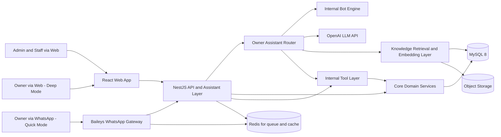
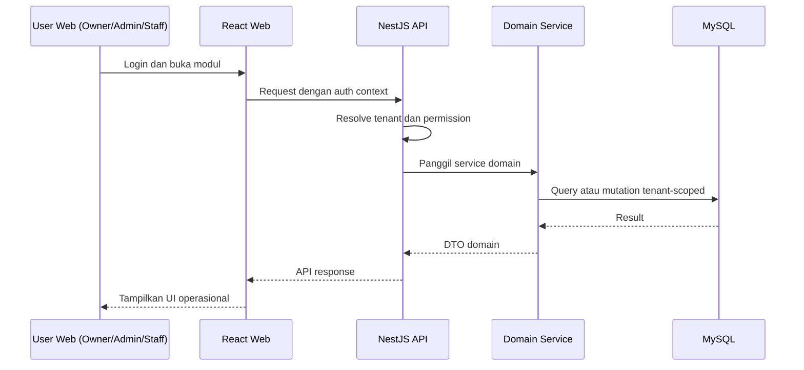
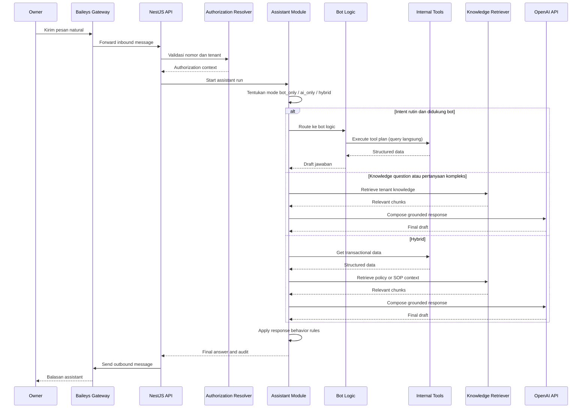

# System Design Document

## 1. Tujuan Dokumen

Dokumen ini mendefinisikan desain sistem tingkat implementasi untuk mini ERP SaaS berbasis monorepo React + NestJS dengan WhatsApp Owner Assistant yang dapat berjalan dengan bot internal, AI, atau hybrid. Dokumen ini disusun agar:

1. Selaras dengan DESKRIPSI_PROJECT.md dan PRD.md.
2. Menutup open decisions teknis utama dari PRD.
3. Tetap menjaga boundary bahwa produk ini adalah mini ERP operasional yang generik, bukan ERP enterprise yang terlalu luas.
4. Menjadi acuan arsitektur, modul backend, alur integrasi, keamanan, observability, dan deployment untuk MVP sampai hardening awal.

---

## 2. Analisis Dokumen Sumber

## 2.1 Analisis DESKRIPSI_PROJECT.md

Deskripsi proyek menetapkan identitas produk secara sangat jelas:

1. Produk bukan ERP besar yang rumit.
2. Web adalah sistem utama untuk semua pengguna termasuk owner (Deep Mode).
3. WhatsApp adalah secondary interface untuk quick access owner (Quick Mode).
4. Owner memiliki dual access: kontrol penuh melalui web dan monitoring cepat melalui WhatsApp.
5. Assistant diposisikan sebagai asisten internal perusahaan, bukan chatbot publik.
6. Bot maupun AI tidak boleh menjadi data source dan tidak boleh mengakses database langsung.
7. RAG hanya dipakai untuk knowledge non-transaksional.
8. Monorepo diperlukan agar type, contract, dan utility konsisten.
9. MVP menggunakan single stock location per tenant secara operasional.
10. Assistant harus default langsung jawab, ringkas, dan WhatsApp-friendly.

Implikasi desain sistem:

1. Domain model harus ringan, generik, dan tidak bias industri.
2. System architecture harus memisahkan operasional web dan owner assistant secara jelas, tetapi tetap berbagi domain service yang sama.
3. Owner assistant harus menjadi lapisan terkontrol di atas tool API dan retrieval layer.
4. Tidak boleh ada jalur cepat yang memberi bot atau AI akses langsung ke repository atau database.
5. Web harus melayani semua pengguna termasuk owner dengan akses penuh.

## 2.2 Analisis PRD.md

PRD mempertegas desain produk dan memberi detail implementasi awal:

1. Modul inti yang menjadi scope adalah auth, tenant config, product, order, stock, user, reporting, WhatsApp, owner assistant tools, knowledge base, audit log.
2. Boundary generic core sudah diperjelas menjadi level item, order, status, stock, user, dan monitoring universal.
3. Variasi tenant dibatasi pada konfigurasi ringan, bukan workflow engine khusus.
4. Multi-tenant isolation, auditability, dan observability adalah persyaratan non-fungsional penting.
5. Open decisions yang harus ditutup di technical design meliputi tenant isolation model, konfigurasi bisnis, tool registry, routing assistant, prompt orchestration, knowledge ingestion, quota AI, dan fallback strategy.
6. Stock MVP beroperasi single-location, DB tetap multi-location (future-ready).
7. Reporting MVP menggunakan query langsung, aggregation table di fase optimasi.
8. Assistant memiliki aturan response behavior eksplisit: default jawab langsung, data parsial tetap dijawab, format WhatsApp-friendly.
9. WhatsApp bersifat read-heavy, aksi kritikal hanya di web.

Implikasi desain sistem:

1. Arsitektur harus memisahkan core domain dari tenant configuration.
2. Workflow order tidak boleh hardcoded ke satu industri.
3. Internal tools harus menjadi contract resmi yang dipakai owner assistant.
4. Pada MVP, tools dan reporting query langsung ke domain tables. Background processing untuk AI, RAG ingestion diperlukan, tetapi aggregation job bersifat opsional dan ditunda ke fase optimasi.

## 2.3 Kesimpulan Analisis

Kedua dokumen sudah konsisten. Posisi owner sudah jelas: web sebagai primary, WhatsApp sebagai secondary. Tantangan desain bukan mencari arah baru, tetapi memilih implementasi yang:

1. cukup generik,
2. cukup aman,
3. cukup maintainable,
4. tidak over-engineered.

Dokumen ini mengambil keputusan desain dengan prinsip tersebut.

---

## 3. Dual Mode Architecture

Sistem mendukung dua mode pengalaman yang didefinisikan pada level arsitektur:

### 3.1 Deep Mode (Web)

- Diakses melalui React Web App.
- Melayani semua pengguna: owner, admin, staff.
- Menyediakan kontrol penuh: CRUD, konfigurasi, monitoring, reporting, analisis.
- Write-heavy operations terjadi di sini.
- Semua aksi kritikal hanya di mode ini.

### 3.2 Quick Mode (WhatsApp)

- Diakses melalui WhatsApp Owner Assistant.
- Hanya melayani owner.
- Bersifat read-heavy: insight, monitoring, Q&A.
- Tidak menyediakan aksi kritikal (create/update/delete data master).
- Aksi ringan opsional (mis. "tandai order X sebagai selesai") bisa dipertimbangkan secara terbatas di fase selanjutnya, bukan MVP.

### 3.3 Boundary Arsitektur

| Aspek | Deep Mode (Web) | Quick Mode (WhatsApp) |
|-------|-----|----------|
| Data access | Full CRUD via REST API | Read-only via Internal Tool API |
| Auth | JWT/Session-based | Phone number → WhatsApp authorization |
| Write operations | ✅ Penuh | ❌ Tidak pada MVP |
| Configuration | ✅ Penuh | ❌ Tidak tersedia |
| Reporting | Detail + filtering + export | Ringkasan via assistant response |

---

## 4. Prinsip Desain Sistem

1. Operational first: web app harus memprioritaskan workflow semua pengguna termasuk owner yang cepat dan sederhana.
2. Web as primary: arsitektur harus memastikan web memberikan pengalaman lengkap untuk semua role.
3. Quick Mode as complement: WhatsApp owner assistant hanya menyediakan subset read-only dari data yang sudah tersedia di web.
4. Shared core domain: web, WhatsApp, reporting, bot, dan AI memakai domain service yang sama.
5. Assistant with hard boundaries: bot dan AI hanya boleh mengakses data melalui tool contracts, bersifat read-heavy.
6. Configurable but bounded: konfigurasi tenant boleh mengubah istilah, status, dan parameter ringan, tetapi tidak mengubah core architecture.
7. Multi-tenant by design: tenant context menjadi bagian dari seluruh jalur data dan auth.
8. Auditability first: perubahan operasional, tool usage, dan event integrasi harus dapat ditelusuri.
9. MVP realism: fase awal harus mudah dibangun dan dioperasikan tanpa infrastruktur berlebihan.

---

## 5. Keputusan Desain Utama

## 5.1 Model Isolasi Tenant

Rekomendasi:

1. Shared database dan shared schema per environment.
2. Semua tabel operasional tenant-scoped memiliki tenant_id.
3. Semua service, repository, dan tool internal menerima tenant context eksplisit.
4. MySQL tidak memiliki Row Level Security native, sehingga tenant guard wajib diterapkan konsisten di service, repository, query builder, dan internal tools.

Alasan:

1. Paling realistis untuk MVP SaaS.
2. Konsisten dengan monorepo dan backend service tunggal.
3. Memudahkan reporting, migrasi schema, dan operasional harian.

## 5.2 Model Konfigurasi Bisnis

Rekomendasi:

1. Gunakan kombinasi structured tables dan lightweight JSON config.
2. Status order dan transisinya disimpan sebagai data terstruktur.
3. Label istilah bisnis, assistant style, dan parameter ringan berada di tenant_settings.
4. Feature flags dasar berada di tenant_features.

Yang tidak dilakukan:

1. Tidak membuat dynamic workflow builder generik.
2. Tidak membuat generic form engine untuk semua kebutuhan tenant.
3. Tidak membuat rule engine kompleks pada MVP.

## 5.3 Model Registry Tool Assistant

Rekomendasi:

1. Tool registry disimpan di kode backend sebagai daftar tool terdaftar dan tervalidasi.
2. Tiap tool memiliki input schema, output schema, authorization guard, dan tenant guard.
3. Tool registry yang sama dipakai oleh bot engine maupun AI orchestration.
4. Database hanya menyimpan audit execution, bukan menjadi source of truth registry.

Alasan:

1. Lebih aman dan mudah dikontrol daripada registry dinamis di database.
2. Konsisten dengan requirement bahwa bot dan AI hanya boleh menggunakan tool yang didaftarkan dan diizinkan.

## 5.4 Strategi Knowledge dan RAG

Rekomendasi:

1. Dokumen knowledge disimpan sebagai metadata + object storage reference.
2. Normalized text, chunking result, dan metadata retrieval disimpan tenant-scoped di MySQL.
3. Embedding disimpan sebagai JSON array pada MVP dan similarity scoring dilakukan di retrieval service terhadap candidate set tenant-scoped yang dibatasi.
4. Retrieval dilakukan hanya untuk knowledge non-transaksional.
5. Jalur AI pada owner assistant harus membedakan intent data real-time vs knowledge Q and A.

## 5.5 Strategi Reporting dan Data Layer

Rekomendasi:

1. **MVP:** Reporting menggunakan query langsung ke tabel transaksional (orders, order_items, items, inventory_balances, inventory_movements) melalui query service / internal tool API. Tidak diperlukan job aggregation atau tabel pre-computed.
2. **Fase Optimasi (Post-MVP):** Tabel `daily_operational_metrics` diaktifkan sebagai optimization layer. Job harian dijalankan untuk mengisi tabel ini. Ini dilakukan hanya setelah volume data meningkat dan query langsung mulai menjadi bottleneck.
3. Internal tools owner assistant pada MVP juga menggunakan query langsung, bukan agregasi pre-computed.

Alasan:

1. Menghindari over-engineering di MVP.
2. Query langsung dengan index yang tepat sudah cukup performant untuk volume awal.
3. Aggregation table dapat ditambahkan tanpa mengubah domain tables.

## 5.6 Strategi Fallback dan Resilience

Rekomendasi:

1. Jika WhatsApp gateway bermasalah, sistem mencatat error, menjaga queue, dan memberi status koneksi untuk admin internal.
2. Jika OpenAI timeout atau error, sistem mencoba fallback ke bot bila intent didukung; jika tidak, sistem memberi fallback response yang jujur dan aman.
3. Jika tool gagal, bot maupun AI tidak boleh mengarang data; sistem harus merespons dengan penjelasan keterbatasan.
4. Jika data ambigu, owner assistant mengikuti aturan response behavior: jawab parsial dengan asumsi yang disebutkan, atau minta klarifikasi hanya jika benar-benar ambigu.

## 5.7 Rate Limit dan Quota AI

Rekomendasi:

1. Rate limit per nomor WhatsApp dan per tenant.
2. Daily quota atau soft quota token/requests per tenant untuk mode `ai_only` dan `hybrid`.
3. Logging cost usage per assistant run ketika AI terlibat.
4. Alert internal jika quota mendekati batas.

## 5.8 Stock Location Strategy

Rekomendasi:

1. **MVP:** Single stock location per tenant secara operasional. Setiap tenant otomatis memiliki satu lokasi default yang dibuat saat provisioning tenant.
2. **Database:** Tabel `stock_locations` dan relasi `inventory_balances` / `inventory_movements` sudah mendukung multi-location. Ini adalah future-ready design, bukan fitur aktif di MVP.
3. **Business Logic MVP:** Semua operasi stok pada MVP secara otomatis menggunakan lokasi default tenant. UI tidak menampilkan selector lokasi.
4. **Expansion:** Multi-location diaktifkan di fase selanjutnya melalui feature flag dan perubahan UI, tanpa migrasi schema.

---

## 6. Arsitektur Tingkat Tinggi



### 6.1 Komponen Utama

1. React Web App untuk semua pengguna: owner (Deep Mode), admin, dan staff.
2. NestJS API sebagai satu-satunya orchestration layer untuk domain, auth, WhatsApp, owner assistant, dan knowledge.
3. MySQL 8 sebagai transaksi utama dan metadata knowledge.
4. Embedding disimpan sebagai JSON tenant-scoped di MySQL pada MVP, dengan abstraksi retrieval yang memungkinkan migrasi ke vector store terpisah bila scale tumbuh.
5. Redis untuk queue, retry, caching ringan, dan rate limit.
6. Object storage untuk file dokumen knowledge dan artefak eksternal.

---

## 7. Monorepo dan Struktur Kode

Struktur yang direkomendasikan tetap selaras dengan PRD:

```text
/apps
  /web
  /api
/packages
  /shared-types
  /shared-contracts
  /shared-utils
  /ui
/docs
```

### 7.1 Rekomendasi Organisasi dalam apps/api

```text
/src
  /modules
    /auth
    /tenant
    /user
    /product
    /order
    /stock
    /reporting
    /whatsapp
    /assistant
    /tools
    /knowledge-rag
    /audit-log
    /config
  /common
  /infrastructure
  /jobs
```

Catatan:

1. Background jobs dapat tetap berada di aplikasi backend yang sama, dijalankan sebagai process profile terpisah bila diperlukan.
2. Tidak wajib membuat app worker terpisah pada MVP.
3. Job aggregation (daily_operational_metrics) tidak perlu dibangun di MVP — ditambahkan di fase optimasi.

---

## 8. Desain Modul Backend

## 8.1 auth module

Tanggung jawab:

1. Login web.
2. Refresh session.
3. Password hashing dan revocation.
4. Permission resolution berdasarkan active role (bukan gabungan semua role).
5. Guard untuk web API.
6. Active role management dan role switching tanpa re-login.

Rekomendasi teknis:

1. Access token singkat.
2. Refresh token rotation dengan penyimpanan hash di database.
3. Access token dikirim via secure HTTP-only cookie atau authorization header sesuai strategi frontend, tetapi penyimpanan browser harus menghindari localStorage untuk refresh token.
4. Saat login, `active_role_id` di `user_sessions` di-set ke role utama (prioritas: owner > admin > staff).
5. Saat switch role, `active_role_id` diupdate dan permission baru dikembalikan ke frontend.
6. Permission yang berlaku = hanya dari `active_role_id`, bukan gabungan semua role user.

## 8.2 tenant module

Tanggung jawab:

1. Mengelola tenant.
2. Mengelola tenant settings dan feature flags.
3. Menyediakan tenant context resolver untuk seluruh modul.
4. Auto-provisioning default stock location saat tenant dibuat (MVP).

Model provisioning tenant:

Produk ini bukan self-serve SaaS dengan halaman signup publik. Tenant baru dibuat oleh **platform operator** (developer atau tim teknis) melalui seed script atau endpoint internal yang tidak terekspos ke publik. Tidak ada UI untuk membuat tenant dari sisi pengguna. Setelah tenant dibuat, owner tenant pertama kali login menggunakan kredensial yang disiapkan oleh platform operator.

## 8.3 user module

Tanggung jawab:

1. CRUD user tenant.
2. Membership, role, permission assignment.
3. Aktivasi dan deaktivasi user.

## 8.4 product module

Tanggung jawab:

1. CRUD item operasional.
2. Klasifikasi item type.
3. Pengaturan stock-tracked behavior.

Boundary penting:

1. Modul ini tidak boleh mengasumsikan semua item adalah barang fisik.

## 8.5 order module

Tanggung jawab:

1. Pencatatan order generik.
2. Pengelolaan status.
3. Histori perubahan status.
4. Validasi transisi status.

Boundary penting:

1. Order tetap generik sebagai transaksi, request, atau job ringan.
2. Tidak berubah menjadi workflow engine kompleks.

## 8.6 stock module

Tanggung jawab:

1. Saldo stok.
2. Mutasi stok.
3. Critical stock detection.
4. Integrasi stok dengan order item yang stock-tracked.

Boundary penting:

1. Item non-stock tidak dipaksa masuk ke inventory flow.
2. **MVP:** Semua operasi stok menggunakan lokasi default tenant secara otomatis. Tidak ada parameter location_id yang perlu diisi oleh pengguna.
3. **Multi-location:** Diaktifkan di fase selanjutnya melalui feature flag.

## 8.7 reporting module

Tanggung jawab:

1. Dashboard operasional web (untuk semua role termasuk owner).
2. Query service untuk agregasi langsung dari tabel transaksional (MVP).
3. Penyedia data untuk internal tools AI.

Boundary penting:

1. **MVP:** Tidak memerlukan job aggregation atau tabel pre-computed. Query langsung ke domain tables dengan index yang tepat.
2. **Post-MVP:** Daily metrics job dan tabel `daily_operational_metrics` diaktifkan sebagai optimization layer saat volume data meningkat.

## 8.8 whatsapp module

Tanggung jawab:

1. Baileys session handling.
2. Incoming message listener.
3. Authorization lookup berdasarkan phone number.
4. Outbound message delivery.
5. Reconnect strategy dan event logging.

## 8.9 tools module

Tanggung jawab:

1. Menjadi controlled data access layer untuk owner assistant.
2. Menyediakan tool contracts yang eksplisit.
3. Menyembunyikan domain complexity dari bot logic maupun LLM.
4. **MVP:** Semua tools query langsung ke domain tables melalui domain services.

Contoh tool:

1. GetSalesSummary
2. GetPendingOrders
3. GetCriticalStock
4. GetTodayPerformance
5. GetOperationalSummary
6. GetPolicyAnswerReference

## 8.10 assistant module

Tanggung jawab:

1. Menerima pesan owner dari modul WhatsApp.
2. Menentukan mode eksekusi `bot_only`, `ai_only`, atau `hybrid`.
3. Menjalankan intent router sederhana untuk query rutin.
4. Menjalankan tool plan langsung untuk jalur bot atau memanggil adapter AI bila diperlukan.
5. Menyusun jawaban final dalam persona assistant internal perusahaan.
6. Mencatat assistant run dan tool executions.
7. Menerapkan aturan response behavior dari PRD.

Response Behavior yang harus diimplementasikan:

1. Default langsung jawab (ringkas, to the point).
2. Data parsial tetap dijawab + jelaskan keterbatasan.
3. Klarifikasi hanya jika ambigu tinggi (maksimal 1 pertanyaan).
4. Output WhatsApp-friendly (pendek, bullet/numbering, emoji secukupnya).

Conversation context injection:

Sebelum memanggil LLM, modul assistant mengambil maksimal **3 pesan terakhir** dari `conversation_messages` pada thread yang sama (kombinasi inbound + outbound, diurutkan `created_at DESC`). Pesan-pesan ini diinjeksikan sebagai conversation history ke LLM agar:
- Jawaban atas pertanyaan klarifikasi dapat dipahami dalam konteks yang benar.
- Pertanyaan follow-up ("bandingkan dengan kemarin", "yang itu maksudnya apa") dapat diantisipasi.

Jika tidak ada pesan sebelumnya (pesan pertama pada thread), tidak ada history yang diinjeksikan.

Boundary penting:

1. Tidak memiliki repository domain langsung.
2. Hanya memakai tool interfaces dan knowledge retriever.
3. Jalur bot maupun AI tidak melakukan write operations (MVP).

## 8.11 knowledge-rag module

Tanggung jawab:

1. Ingestion dokumen.
2. Chunking dan embedding.
3. Retrieval tenant-scoped.
4. Penyedia konteks knowledge untuk orchestrator.

## 8.12 audit-log module

Tanggung jawab:

1. Audit trail pengguna.
2. Audit tool usage.
3. Event log teknis.

---

## 9. Alur Sistem Inti

## 9.1 Alur Web Operasional (Deep Mode)



## 9.2 Alur Owner via WhatsApp Assistant (Quick Mode)



## 9.3 Alur Ingestion Knowledge

1. Admin mengunggah atau mendaftarkan dokumen knowledge.
2. Sistem menyimpan metadata dokumen dan file source.
3. Job ingestion mengekstrak teks dan membuat version record.
4. Job chunking memecah teks menjadi chunk yang sesuai.
5. Job embedding menghasilkan array embedding dan menyimpan ke knowledge_chunks dalam format JSON.
6. Retriever menggunakan tenant_id sebagai hard filter pada query similarity.

---

## 10. API dan Contract Strategy

## 10.1 Kontrak Antar Web dan API

1. Gunakan shared-contracts untuk DTO dan contract validation.
2. Gunakan shared-types untuk enum dan type yang dipakai lintas app.
3. Semua response order, item, dan reporting harus sudah tenant-safe dan permission-safe sebelum meninggalkan backend.

## 10.2 Internal Tool Contract Strategy

Setiap tool internal minimal memiliki:

1. tool_name
2. purpose
3. input schema
4. output schema
5. tenant context requirement
6. authorization requirement
7. timeout dan error policy

Contoh struktur logis:

1. GetSalesSummary(tenant_id, date_range) — query langsung pada MVP
2. GetPendingOrders(tenant_id, limit, order_kind optional) — query langsung
3. GetCriticalStock(tenant_id, threshold optional) — query langsung
4. GetTodayPerformance(tenant_id, date) — query langsung
5. GetPolicyAnswerReference(tenant_id, query) — via RAG retrieval

---

## 11. Desain Data dan Penyimpanan

## 11.1 Transaksional

1. MySQL menjadi source of truth untuk tenant, user, item, order, stock, audit, conversation, dan assistant execution.
2. Semua aggregate penting dibangun di atas domain tables yang sama.
3. **MVP:** Agregasi dilakukan on-the-fly melalui query langsung dengan index yang tepat.

## 11.2 Knowledge

1. Dokumen mentah disimpan di object storage.
2. Metadata, versioning, dan chunks disimpan tenant-scoped di MySQL.
3. Embedding disimpan sebagai JSON di MySQL pada MVP dan dihitung similarity-nya di retrieval service setelah candidate set dipersempit oleh tenant dan filter dokumen.

## 11.3 Cache dan Queue

Redis dipakai untuk:

1. rate limiting,
2. retry queue untuk WhatsApp delivery,
3. async job untuk ingestion,
4. caching hasil reporting ringan bila diperlukan (post-MVP optimization).

---

## 12. Desain Keamanan

## 12.1 Web Security

1. Password di-hash dengan algoritma modern seperti Argon2id.
2. Refresh token disimpan sebagai hash.
3. Session revocation harus didukung.
4. Permission diperiksa di backend, bukan hanya di frontend.
5. Audit login, logout, dan perubahan kredensial dicatat.

## 12.2 Tenant Isolation Security

1. Tenant context wajib di service layer dan repository layer.
2. Unique constraint harus tenant-aware.
3. Query lintas tenant hanya boleh terjadi pada admin internal platform yang memang diizinkan, bukan pada tenant runtime biasa.

## 12.3 Assistant Security

1. Bot maupun AI tidak memiliki akses database atau repository langsung.
2. Jalur AI hanya mendapat data yang sudah melalui validasi tool dan retrieval.
3. Tool input harus tervalidasi schema dan authorization.
4. Prompt harus menyertakan guardrail tenant dan identity context.
5. Response harus menolak atau membatasi ketika data tidak tersedia atau pertanyaan di luar scope.
6. Bot maupun AI tidak melakukan write operations di WhatsApp (MVP).

## 12.4 Secret Management

1. OpenAI API key, credential Baileys, database secret, dan object storage key harus berada di secret manager atau environment vault.
2. Jangan simpan secret mentah di database.

---

## 13. Observability dan Auditability

## 13.1 Logging

Pisahkan log menjadi:

1. application log untuk request lifecycle,
2. audit log untuk aktivitas bisnis,
3. integration event log untuk WhatsApp, assistant, dan jobs.

## 13.2 Metrics

Metric minimum:

1. request latency backend,
2. error rate per module,
3. WhatsApp reconnect frequency,
4. assistant response latency,
5. tool execution latency,
6. knowledge retrieval hit rate,
7. tenant-level assistant usage.

## 13.3 Traceability

Setiap pertanyaan owner idealnya bisa ditelusuri melalui rantai berikut:

1. inbound WhatsApp message,
2. authorization context,
3. assistant run,
4. tool executions atau retrieval,
5. outbound WhatsApp response.

---

## 14. Kinerja dan Skalabilitas

## 14.1 Prinsip Performa

1. Query operasional harian harus sederhana dan di-index.
2. **MVP:** Semua aggregation dilakukan on-the-fly melalui query langsung. Tidak diperlukan aggregation job pada fase ini.
3. **Post-MVP:** Agregasi berat dipindahkan ke job harian dan tabel `daily_operational_metrics` saat volume meningkat.
4. Jalur AI pada assistant tidak boleh memblokir loop integrasi WhatsApp tanpa timeout yang jelas.

## 14.2 Strategi Skalabilitas

Tahap awal:

1. Satu backend service dengan beberapa process profile.
2. Satu MySQL instance.
3. Redis tunggal untuk queue dan cache.

Tahap berikutnya:

1. Pisahkan job processor dari API serving process.
2. Tambahkan read replica database bila reporting meningkat.
3. Pertimbangkan vector store terpisah bila knowledge scale tumbuh besar.
4. Aktifkan tabel aggregation dan daily metrics job.

## 14.3 Strategi Caching

Cache yang aman dan berguna:

1. dashboard summary singkat (post-MVP optimization),
2. tenant settings dan feature flags,
3. daftar critical stock (short TTL).

Cache yang tidak dianjurkan tanpa invalidation jelas:

1. order detail aktif,
2. permission resolution yang sangat dinamis tanpa TTL hati-hati,
3. data grounding assistant yang riskan stale.

---

## 15. Strategi Deployment

## 15.1 Topologi Rekomendasi MVP

1. React web app sebagai static build atau SSR sesuai keputusan frontend implementation.
2. NestJS API sebagai service utama.
3. Process job dalam image yang sama, dijalankan terpisah bila perlu.
4. MySQL 8.
5. Redis.
6. Object storage.

## 15.2 Lingkungan Minimum

1. Development
2. Staging
3. Production

## 15.3 Praktik Deployment

1. Migration database dijalankan otomatis tetapi terkontrol.
2. Feature flags dipakai untuk mengaktifkan capability bertahap per tenant.
3. Healthcheck harus memeriksa API, database, Redis, dan konektivitas WhatsApp gateway dasar.

---

## 16. Strategi Pengujian

## 16.1 Unit Test

Prioritas:

1. domain service order,
2. stock movement logic (single location MVP),
3. status transition validation,
4. tenant context guards,
5. assistant tool adapters.

## 16.2 Integration Test

Prioritas:

1. web API ke database,
2. order ke stock integration (single location),
3. WhatsApp inbound ke assistant module,
4. assistant ke tools (query langsung),
5. assistant ke knowledge retriever.

## 16.3 Security Test

Prioritas:

1. tenant isolation,
2. unauthorized WhatsApp access,
3. role enforcement,
4. tool boundary validation,
5. prompt injection resistance pada jalur RAG dan tool orchestration.

## 16.4 UAT

Fokus utama:

1. staff dapat menyelesaikan proses inti tanpa kebingungan,
2. owner dapat bertanya natural via WhatsApp dan menerima jawaban yang berguna, ringkas, dan WhatsApp-friendly,
3. owner dapat login ke web dan menggunakan kontrol penuh serta dashboard operasional,
4. assistant menjawab langsung tanpa terlalu banyak tanya balik,
5. tenant configuration ringan benar-benar cukup untuk variasi bisnis target.

---

## 17. Rekomendasi Implementasi Bertahap

## 17.1 Phase 1 - Foundation

1. tenant, auth, user membership, role-permission
2. item, order, status definitions, status history
3. stock basics (single location per tenant)
4. auto-provision default stock location saat tenant dibuat
5. audit log basics
6. shared contracts and shared types

## 17.2 Phase 2 - Operational Web MVP

1. product, order, stock UI (single location, no location selector)
2. reporting summary (query langsung, tanpa aggregation job)
3. dashboard operasional untuk semua role termasuk owner
4. tenant settings and feature flags
5. permission-aware navigation

## 17.3 Phase 3 - WhatsApp Owner Assistant MVP

1. Baileys channel
2. whatsapp authorization mapping
3. assistant module dengan bot-first routing + response behavior rules
4. top priority tools (query langsung)
5. conversation logging
6. WhatsApp-friendly output formatting

## 17.4 Phase 4 - Knowledge and RAG

1. document upload and ingestion
2. chunking and embeddings
3. retrieval layer
4. hybrid answers with tool plus knowledge

## 17.5 Phase 5 - Hardening and Optimization

1. quotas and rate limits
2. retries and resilience
3. daily_operational_metrics table activation + aggregation job
4. deeper observability
5. multi-location stock activation (via feature flag)

---

## 18. Batas Sistem yang Harus Dijaga

Sistem ini akan tetap selaras dengan dokumen sumber selama batas berikut dijaga:

1. Core module tetap berada pada level item, order, stock, user, reporting, dan configuration ringan.
2. Tidak menambahkan workflow engine berat ke core.
3. Tidak memberi owner assistant jalur akses data di luar internal tools dan retrieval layer yang terkontrol.
4. Tidak memaksa seluruh tenant mengikuti model barang fisik atau retail murni.
5. Tidak mengubah owner assistant menjadi chatbot publik yang lepas dari tenant context.
6. Web tetap menjadi primary system. WhatsApp tidak menggantikan fungsi web.
7. MVP beroperasi single stock location. Multi-location ditambahkan via feature flag.
8. MVP reporting menggunakan query langsung. Aggregation table ditambahkan di fase optimasi.

---

## 19. Ringkasan Desain

Desain sistem ini sengaja memilih pendekatan yang ketat namun pragmatis:

1. Domain operasional dijaga sederhana dan generik.
2. Web sebagai primary system untuk semua pengguna termasuk owner (Deep Mode).
3. WhatsApp sebagai secondary interface untuk owner quick insight (Quick Mode).
4. Fleksibilitas tenant ditempatkan pada konfigurasi yang terbatas.
5. Owner assistant diposisikan sebagai lapisan yang diaudit, bersifat read-heavy, dan mengikuti aturan response behavior eksplisit.
6. RAG dipakai sebagai pelengkap knowledge, bukan pengganti data transaksi.
7. Infrastruktur cukup modern dan aman, tetapi tidak berlebihan untuk MVP.
8. Stock MVP single-location, DB future-ready multi-location.
9. Reporting MVP query langsung, aggregation table di fase optimasi.

Dengan keputusan ini, sistem tetap profesional, best-practice, dan tetap setia pada arah produk yang sudah didefinisikan di DESKRIPSI_PROJECT.md dan PRD.md.
