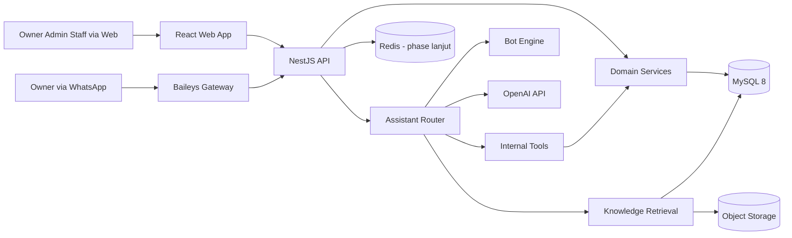

# System Design Document

## 1. Tujuan Dokumen

Dokumen ini mendefinisikan desain sistem tingkat implementasi untuk mini ERP berbasis monorepo React + NestJS dengan WhatsApp Owner Assistant, dengan asumsi dasar:

1. **Satu perusahaan per instance aplikasi**
2. **Banyak cabang**
3. Web sebagai sistem utama
4. WhatsApp sebagai jalur quick insight owner

---

## 2. Keputusan Desain Utama

### 2.1 Model Organisasi

Model data utama:

1. `company` sebagai identitas bisnis tunggal pada instance aplikasi
2. `branches` sebagai unit operasional
3. `active_branch_id` pada session web
4. `active_role_id` pada session web

Implikasi:

1. Konfigurasi inti bisnis berada di level perusahaan
2. Order, stok, dan monitoring harian berjalan di level cabang
3. Produk, kategori, pihak bisnis, dan role dapat dibagi lintas cabang dalam perusahaan yang sama

### 2.2 Context Resolution

1. Permission di-resolve dari `active_role_id`
2. Operasional web di-resolve dari `active_branch_id`
3. Jika user hanya punya satu cabang, branch aktif di-set otomatis saat login
4. Jika user punya banyak cabang, frontend diarahkan ke `/select-branch`

### 2.3 Batas Fleksibilitas

Yang boleh fleksibel:

1. label bisnis,
2. status dan transisi ringan,
3. parameter reporting,
4. preferensi assistant,
5. akses branch per user.

Yang tidak dibangun pada MVP:

1. workflow engine berat,
2. multi-company runtime,
3. multi-location stock per cabang,
4. approval engine,
5. dynamic form engine.

---

## 3. Dual Mode Architecture

### 3.1 Deep Mode (Web)

- Untuk owner, admin, dan staff
- Menyediakan CRUD, monitoring, reporting, dan konfigurasi
- Seluruh aksi kritikal hanya dilakukan di web

### 3.2 Quick Mode (WhatsApp)

- Hanya untuk owner
- Bersifat read-heavy
- Tidak melakukan write operations pada MVP

### 3.3 Boundary

| Aspek | Web | WhatsApp |
|-------|-----|----------|
| Auth context | JWT + session | Phone authorization |
| Data access | REST API | Internal tools |
| Write operations | Ya | Tidak pada MVP |
| Konfigurasi | Ya | Tidak |
| Reporting | Detail | Ringkasan |

---

## 4. Prinsip Arsitektur

1. Web as primary
2. WhatsApp as complement
3. Shared core domain
4. Branch-aware by design
5. Assistant with hard boundaries
6. Configurable but bounded
7. Auditability first
8. MVP realism

---

## 5. Arsitektur Tingkat Tinggi



Catatan:

1. Redis tidak wajib untuk foundation awal bila Phase 1 hanya mencakup API + DB.
2. Phase 1 cukup memverifikasi bahwa API dapat start dan DB dapat terkoneksi. Redis dan WhatsApp ditambahkan setelah dependency-nya masuk.

---

## 6. Monorepo dan Struktur Kode

```text
/apps
  /web
  /api
/packages
  /shared-types
  /shared-contracts
  /ui
```

### 6.1 Struktur apps/api

```text
/src
  /modules
    /auth
    /company
    /branch
    /user
    /product
    /order
    /stock
    /reporting
    /whatsapp
    /assistant
    /tools
    /knowledge-rag
    /audit-log
    /config
  /common
  /infrastructure
```

---

## 7. Modul Backend

### 7.1 auth module

Tanggung jawab:

1. login,
2. refresh token rotation,
3. logout,
4. resolve active role,
5. resolve active branch,
6. switch role,
7. switch branch.

### 7.2 company module

Tanggung jawab:

1. company settings,
2. company feature flags,
3. order status definitions,
4. order status transitions.

### 7.3 branch module

Tanggung jawab:

1. list branch yang dapat diakses user,
2. branch selection,
3. branch default stock location provisioning,
4. branch-scoped context helper.

### 7.4 user module

Tanggung jawab:

1. CRUD user internal,
2. role assignment,
3. branch access assignment,
4. aktivasi/deaktivasi user.

### 7.5 product module

Tanggung jawab:

1. CRUD item operasional,
2. kategori item,
3. stock-tracked rules.

Catatan: produk dibagi di level perusahaan dan dapat dipakai lintas cabang.

### 7.6 order module

Tanggung jawab:

1. create/update order,
2. status flow,
3. status history,
4. branch-scoped order numbering.

### 7.7 stock module

Tanggung jawab:

1. saldo stok per cabang,
2. mutasi stok,
3. critical stock detection,
4. single default location per cabang pada MVP.

### 7.8 reporting module

Tanggung jawab:

1. dashboard summary,
2. operational reports,
3. penyedia data untuk tools assistant.

Catatan: MVP memakai query langsung, bukan aggregation job.

### 7.9 whatsapp module

Tanggung jawab:

1. session handling Baileys,
2. authorization lookup owner,
3. inbound/outbound message,
4. reconnect logging.

### 7.10 tools module

Tanggung jawab:

1. menjadi controlled data access layer untuk assistant,
2. menyediakan input/output schema yang tegas,
3. menerima company context dan optional branch filter.

### 7.11 assistant module

Tanggung jawab:

1. routing `bot_only`, `ai_only`, `hybrid`,
2. intent handling,
3. compose response,
4. audit assistant run dan tool execution.

### 7.12 knowledge-rag module

Tanggung jawab:

1. ingestion,
2. chunking,
3. embedding,
4. retrieval.

### 7.13 audit-log module

Tanggung jawab:

1. audit aktivitas pengguna,
2. audit tool usage,
3. event log teknis dasar.

---

## 8. Data Scoping Strategy

### 8.1 Company-Scoped

Data berikut berada di level perusahaan:

1. company settings
2. feature flags
3. users dan akses cabang
4. roles dan permissions
5. products dan categories
6. business parties
7. order status definitions
8. knowledge documents
9. WhatsApp authorization

### 8.2 Branch-Scoped

Data berikut berada di level cabang:

1. orders
2. order status history
3. stock locations
4. inventory balances
5. inventory movements
6. daily operational metrics
7. sebagian audit log operasional

---

## 9. Security Design

### 9.1 Web Security

1. Password di-hash dengan Argon2id atau bcrypt yang dikunci konsisten di seluruh dokumen implementasi.
2. Refresh token disimpan sebagai hash.
3. Permission diperiksa di backend.
4. Branch access diperiksa di backend.

### 9.2 Branch Isolation

1. Semua query operasional wajib menggunakan `active_branch_id` atau branch filter yang tervalidasi.
2. User tidak boleh mengakses data cabang di luar daftar aksesnya.
3. Unique constraint pada data operasional harus branch-aware bila relevan.

### 9.3 Assistant Security

1. Bot dan AI tidak memiliki akses database langsung.
2. Semua data diperoleh lewat tool yang tervalidasi.
3. Tool menerima company context dan optional branch filter.
4. WhatsApp tidak melakukan write operations pada MVP.

---

## 10. Observability dan Auditability

Pisahkan log menjadi:

1. application log,
2. audit log,
3. integration event log.

Metric minimum:

1. request latency,
2. error rate per module,
3. assistant latency,
4. tool execution latency,
5. branch-level usage,
6. WhatsApp reconnect frequency.

---

## 11. Strategi Reporting

1. **MVP:** query langsung ke tabel transaksional.
2. **Phase lanjut:** aktifkan tabel agregasi `daily_operational_metrics`.
3. Reporting default memakai cabang aktif.
4. Ringkasan lintas cabang dapat ditambahkan di atas query service yang sama.

---

## 12. Strategi Deployment

Topologi minimum:

1. React web
2. NestJS API
3. MySQL

Topologi phase lanjut:

1. Redis
2. object storage
3. background jobs

---

## 13. Strategi Pengujian

### 13.1 Unit Test Prioritas

1. auth dan session context,
2. branch guard,
3. order status transition,
4. stock movement logic,
5. tool adapters.

### 13.2 Integration Test Prioritas

1. web API ke database,
2. order ke stock integration,
3. branch isolation,
4. assistant ke tools,
5. assistant ke knowledge retriever.

---

## 14. Rekomendasi Implementasi Bertahap

### Phase 1 - Foundation

1. company dan branch context
2. auth
3. user, role, branch access
4. item, order, stock basics
5. shared contracts dan types
6. audit log basics

### Phase 2 - Operational Web MVP

1. dashboard
2. product, order, stock UI
3. user management
4. company settings
5. reporting dasar

### Phase 3 - WhatsApp Owner Assistant MVP

1. Baileys channel
2. owner authorization
3. assistant module
4. priority tools
5. conversation logging

### Phase 4 - Knowledge & RAG

1. document upload
2. chunking
3. embedding
4. retrieval

### Phase 5 - Hardening & Optimization

1. quotas
2. resilience
3. aggregation
4. observability
5. multi-location stock bila dibutuhkan

---

## 15. Batas Sistem yang Harus Dijaga

1. Web tetap menjadi primary system.
2. WhatsApp tetap read-heavy.
3. Tidak membangun multi-company pada fase ini.
4. Tidak mengaktifkan multi-location stock pada MVP.
5. Tidak mengubah core menjadi workflow engine berat.

---

## 16. Ringkasan Desain

Desain sistem dibangun untuk menangani satu perusahaan dengan multiple cabang, menggunakan model `single company + multi-branch` sebagai fondasi data.

Perubahan ini membuat foundation lebih sederhana:

1. permission tetap berbasis role aktif,
2. operasional harian berbasis cabang aktif,
3. master data inti dibagi lintas cabang,
4. assistant tetap aman melalui tools,
5. ekspansi tetap terbuka untuk phase berikutnya.
