# System Flow

## 1. Tujuan Dokumen

Dokumen ini mendeskripsikan alur inti sistem mini ERP SaaS pada dua mode utama:

1. `Deep Mode` melalui web untuk operasional penuh.
2. `Quick Mode` melalui WhatsApp Owner Assistant untuk insight cepat owner.

Dokumen ini sengaja menekankan perubahan minimum agar tetap selaras dengan PRD, SYSTEM_DESIGN, dan DB_SCHEMA tanpa menambah kompleksitas yang tidak perlu.

---

## 2. Daftar Flow

| # | Flow | Mode | Actor |
|---|------|------|-------|
| 1 | Login & Tenant Selection | Web | Semua |
| 2 | Manajemen Produk | Web | Admin/Staff |
| 3 | Pembuatan Order | Web | Admin/Staff |
| 4 | Perubahan Status Order | Web | Admin/Staff |
| 5 | Penyesuaian Stok | Web | Admin |
| 6 | Owner WhatsApp Query | WhatsApp | Owner |
| 7 | Knowledge Query | WhatsApp | Owner |
| 8 | Order -> Stock Integration | System | System |
| 9 | Switch Role | Web | Semua (multi-role) |

---

## 3. Flow Detail

### 3.1 Login & Tenant Selection

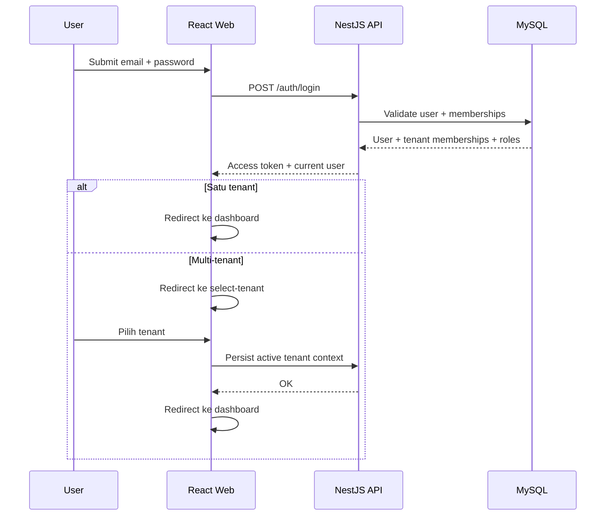

---

### 3.2 Manajemen Produk (Create)

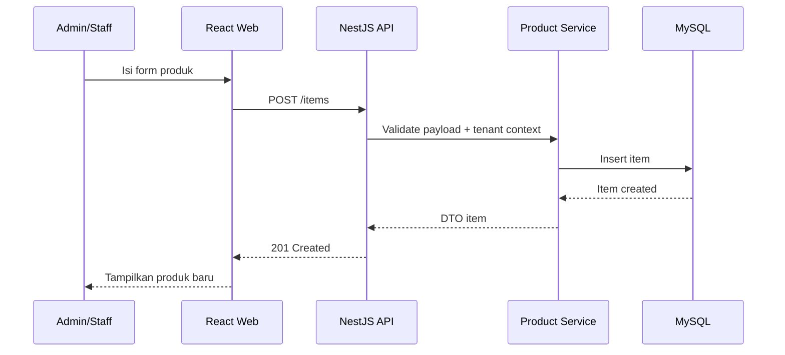

---

### 3.3 Pembuatan Order

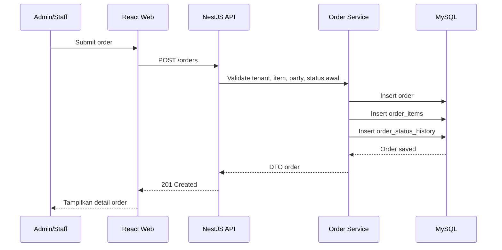

---

### 3.4 Perubahan Status Order

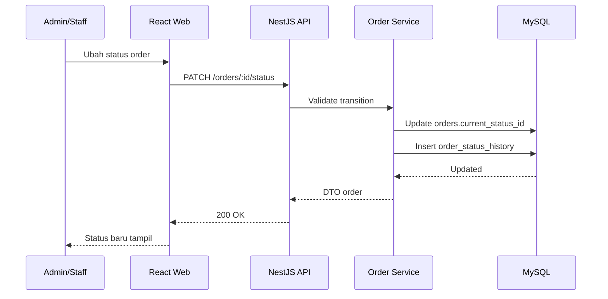

---

### 3.5 Penyesuaian Stok

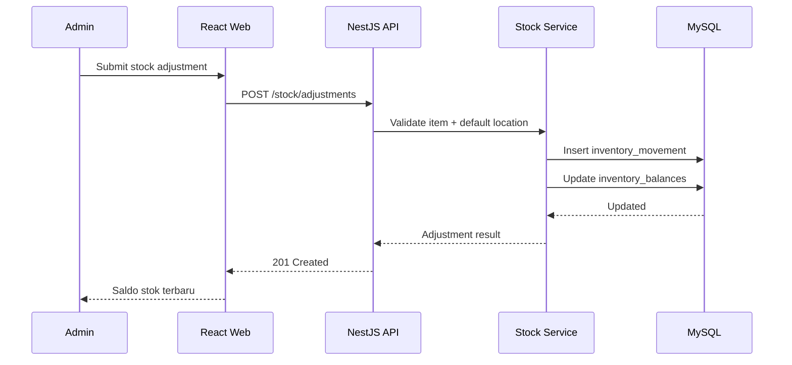

---

### 3.6 Owner WhatsApp Query (Quick Mode)

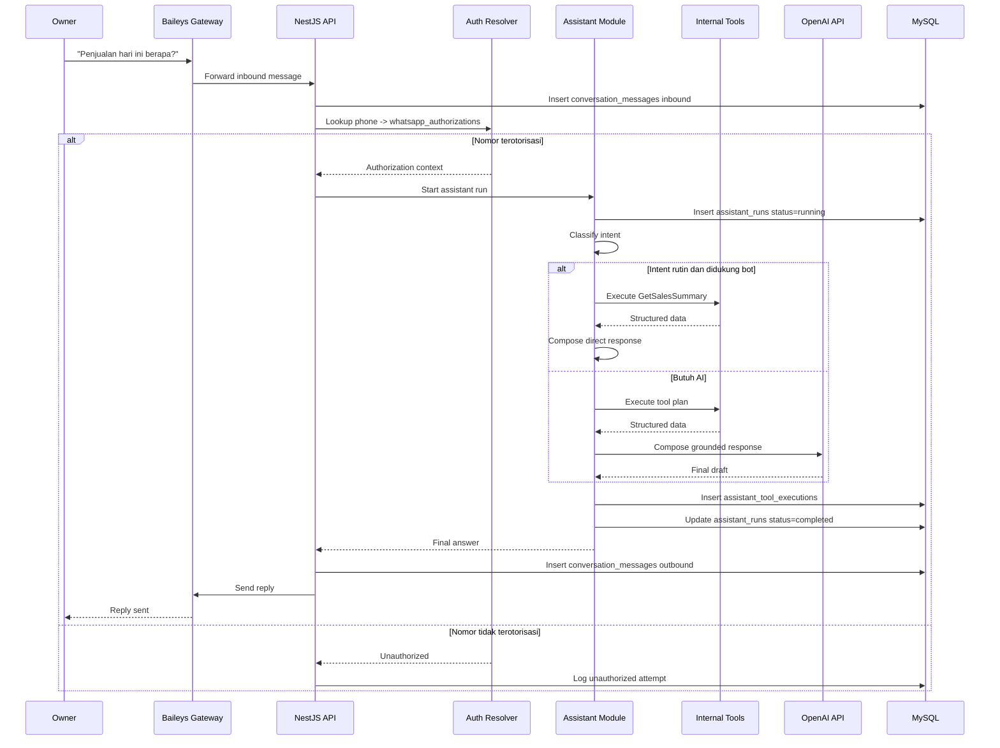

---

### 3.7 Knowledge Query (Quick Mode)

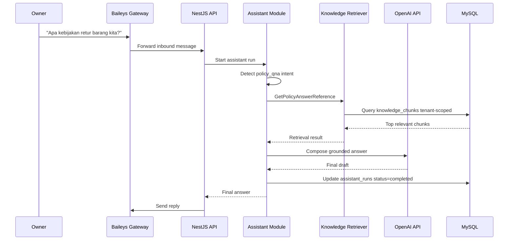

---

### 3.8 Order -> Stock Integration

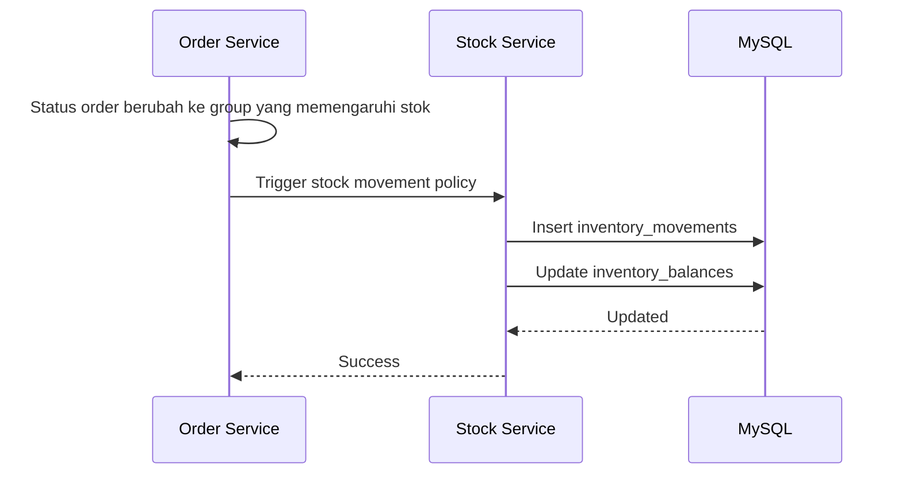

---

### 3.9 Switch Role

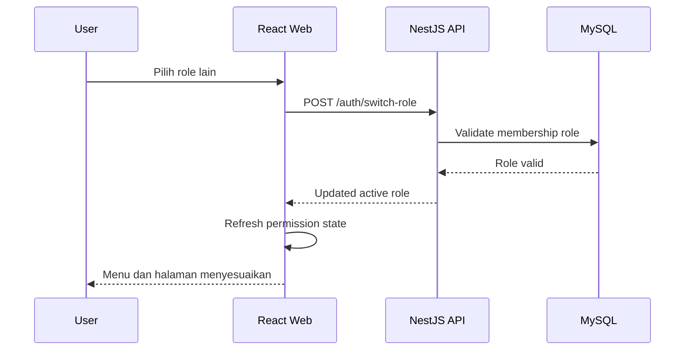

---

## 4. Flow Non-Happy Path

### 4.1 WhatsApp Gateway Disconnect

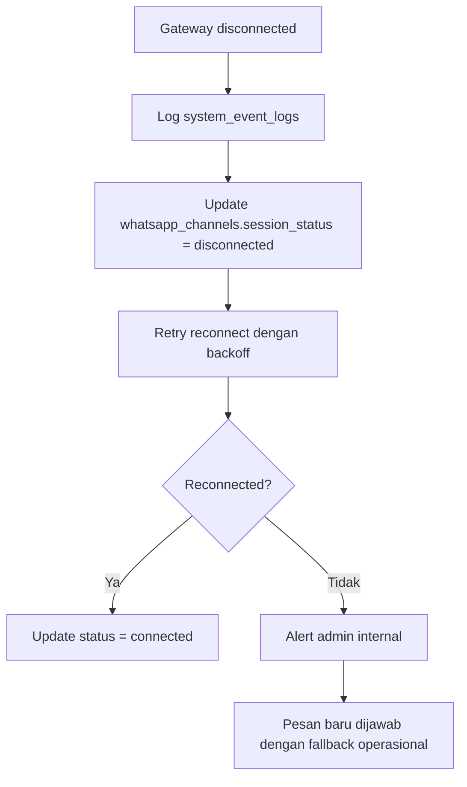

---

### 4.2 Assistant Tool Failure

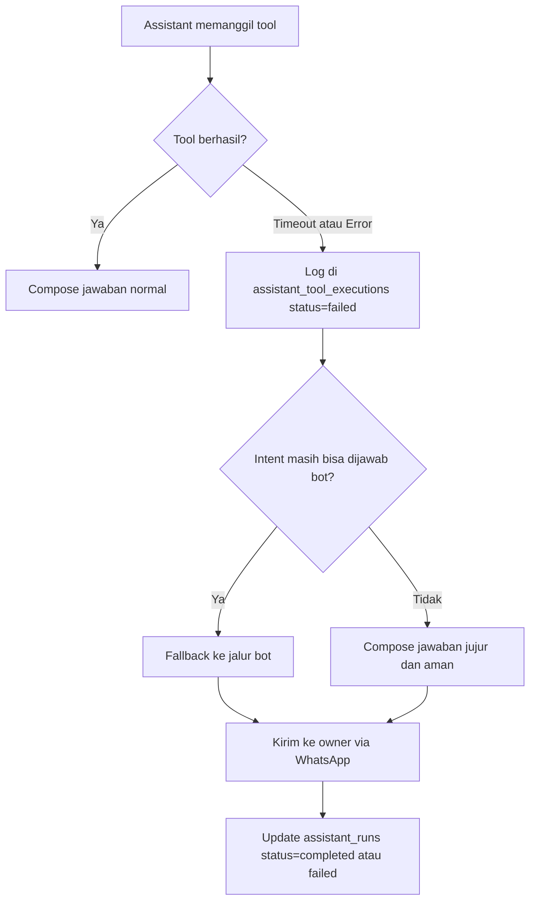

---

### 4.3 Data Ambigu / Parsial

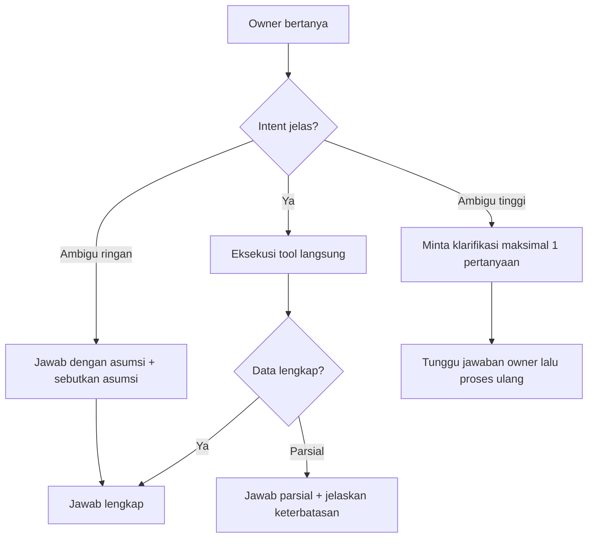

---

## 5. Ringkasan Referensi Silang

| Flow | API Endpoints | Tools | DB Tables |
|------|---------------|-------|-----------|
| Login | /auth/login, /auth/me | - | users, tenant_user_memberships, roles |
| Product Create | /items (POST) | - | items, item_categories |
| Order Create | /orders (POST) | - | orders, order_items, order_status_history |
| Status Change | /orders/:id/status | - | orders, order_status_history, order_status_transitions |
| Stock Adjustment | /stock/adjustments (POST) | - | inventory_movements, inventory_balances |
| WA Sales Query | - | GetSalesSummary | orders, assistant_runs, assistant_tool_executions |
| WA Knowledge Query | - | GetPolicyAnswerReference | knowledge_chunks, assistant_runs |
| Order -> Stock | Internal trigger | - | inventory_movements, inventory_balances |
