# System Flow

## 1. Tujuan Dokumen

Dokumen ini menjelaskan alur inti sistem untuk model:

1. satu perusahaan,
2. banyak cabang,
3. web sebagai primary system,
4. WhatsApp sebagai secondary interface owner.

---

## 2. Daftar Flow

| # | Flow | Mode | Actor |
|---|------|------|-------|
| 1 | Login & Branch Selection | Web | Semua |
| 2 | Product Management | Web | Admin/Staff |
| 3 | Order Create | Web | Admin/Staff |
| 4 | Order Status Change | Web | Admin/Staff |
| 5 | Stock Adjustment | Web | Admin |
| 6 | Branch Switch | Web | Semua |
| 7 | Owner WhatsApp Query | WhatsApp | Owner |
| 8 | Knowledge Query | WhatsApp | Owner |
| 9 | Order -> Stock Integration | System | System |

---

## 3. Flow Detail

### 3.1 Login & Branch Selection

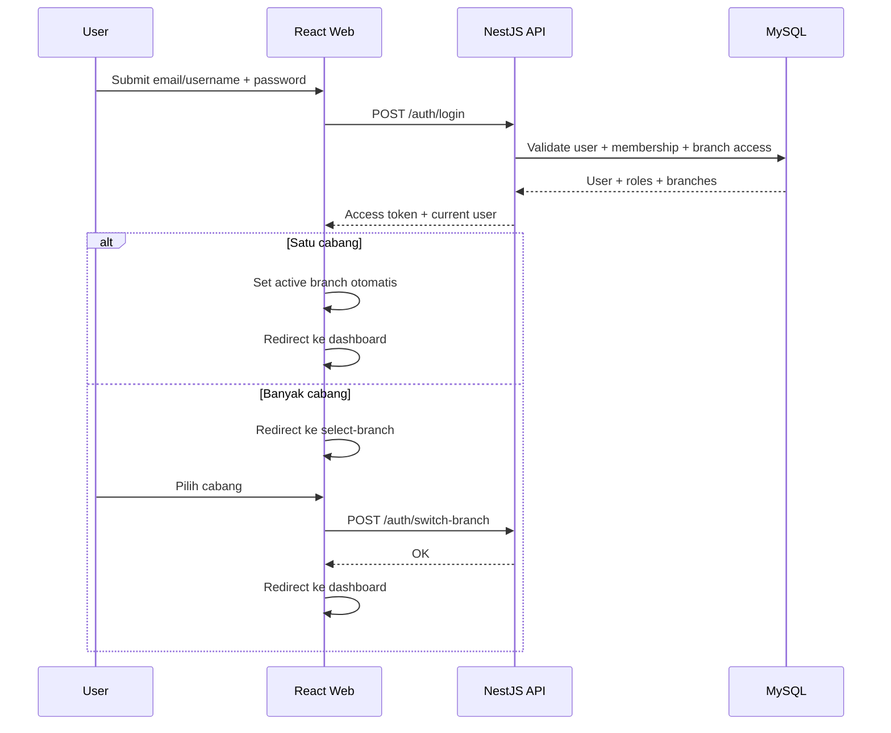

### 3.2 Manajemen Produk

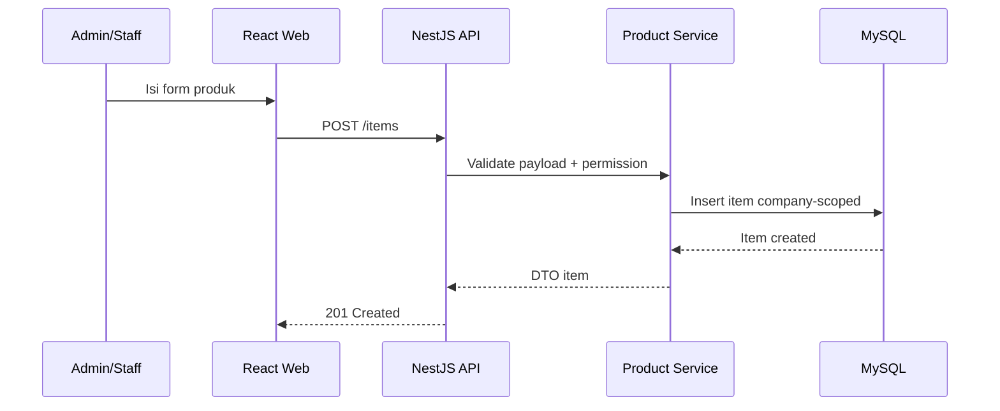

### 3.3 Pembuatan Order

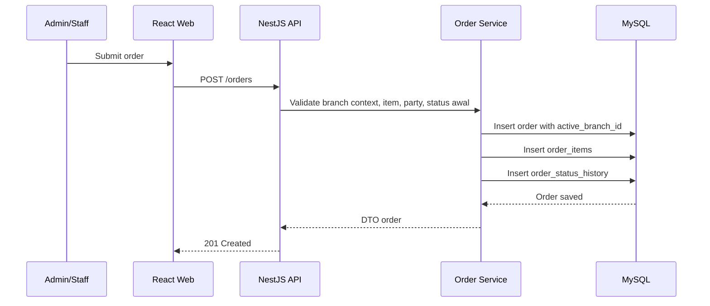

### 3.4 Perubahan Status Order

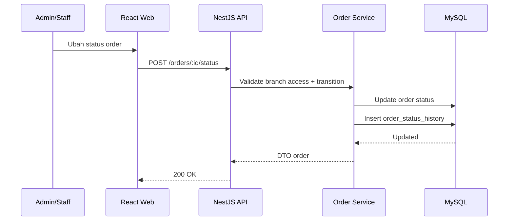

### 3.5 Penyesuaian Stok

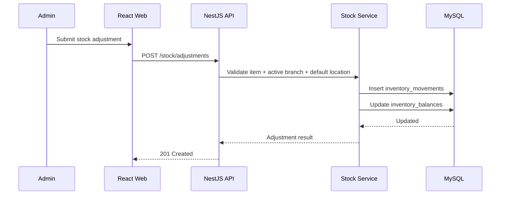

### 3.6 Branch Switch

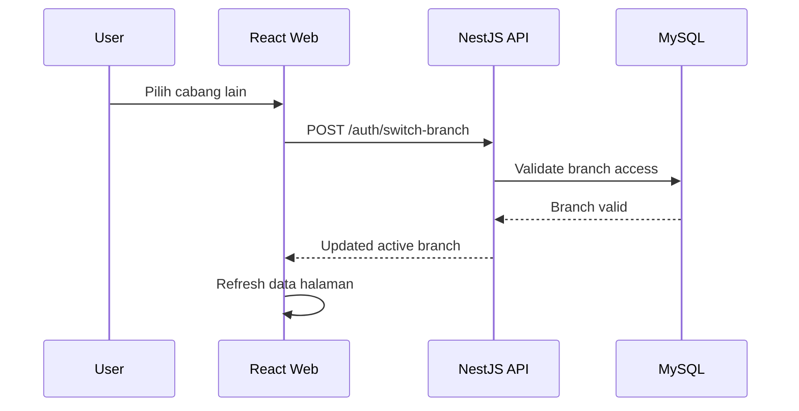

### 3.7 Owner WhatsApp Query

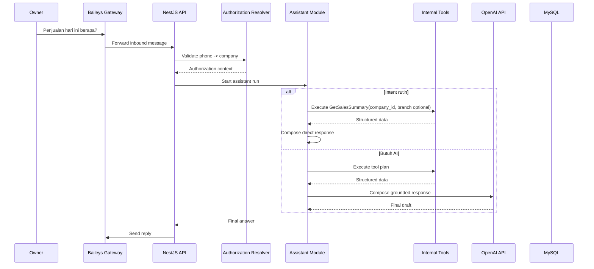

### 3.8 Knowledge Query

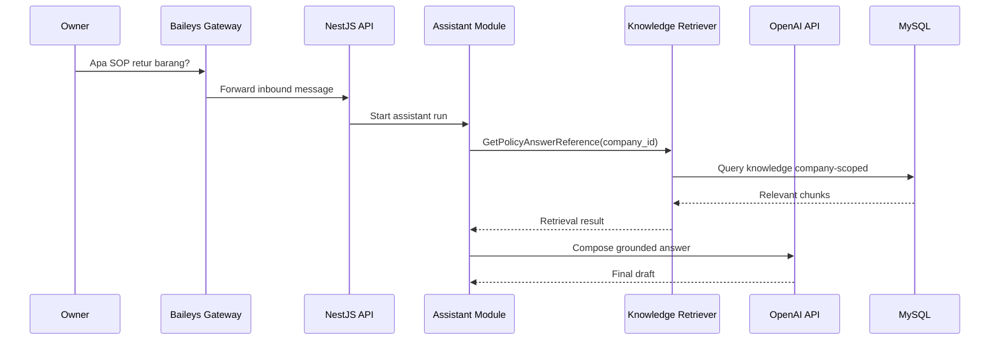

### 3.9 Order -> Stock Integration

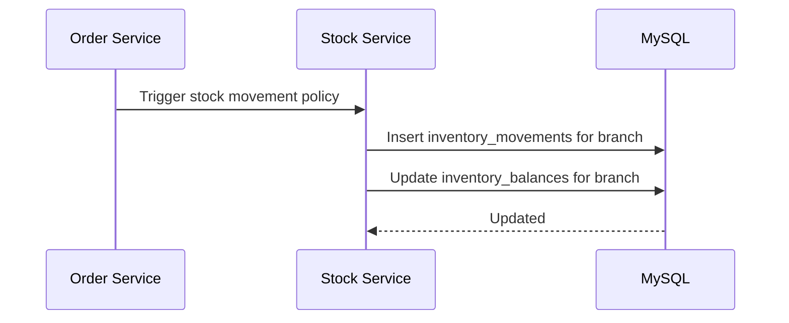

---

## 4. Non-Happy Path

### 4.1 Assistant Tool Failure

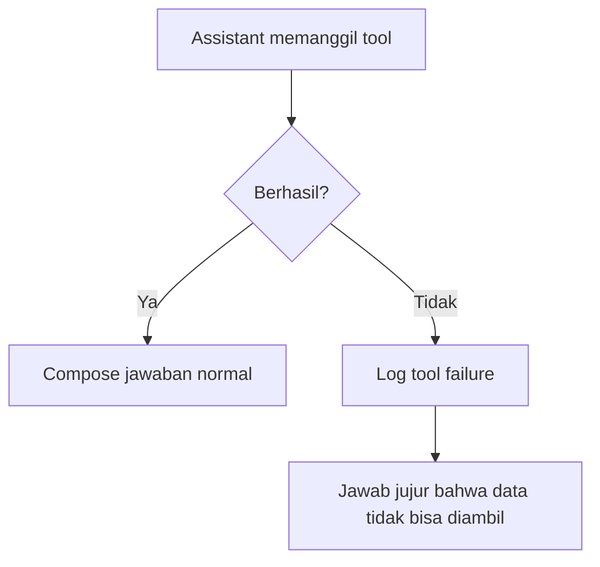

### 4.2 Branch Access Invalid

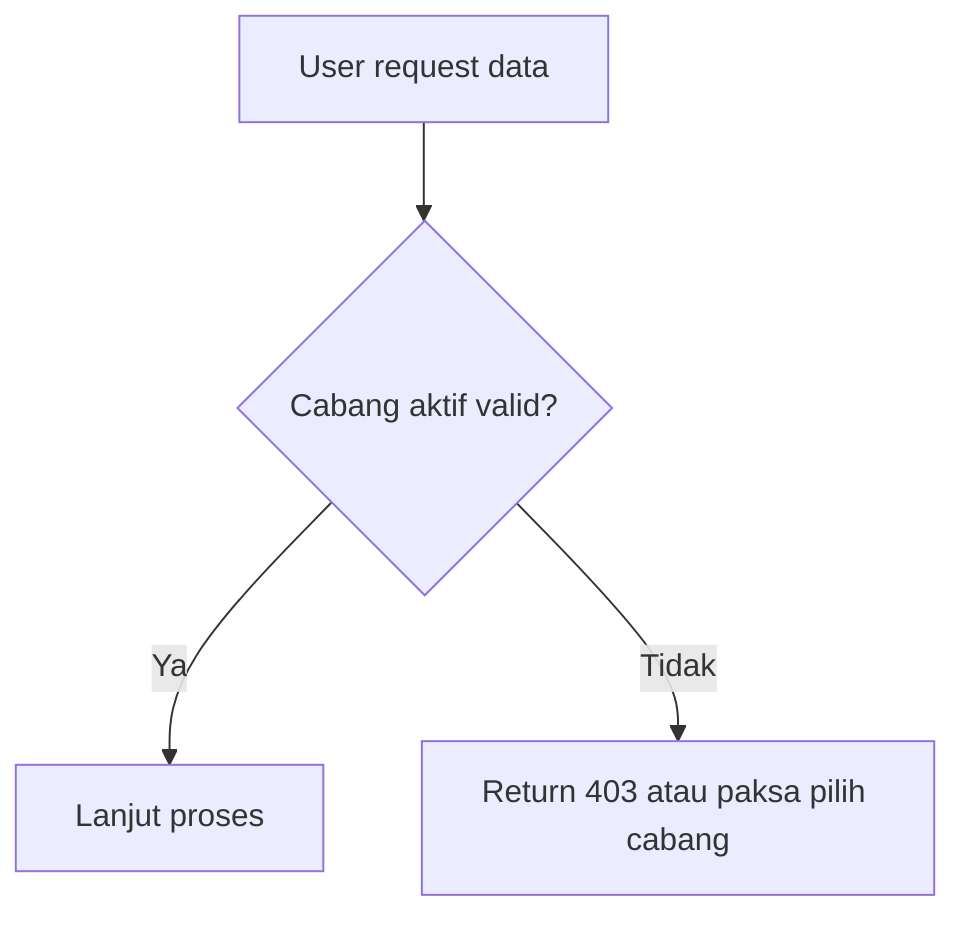

---

## 5. Ringkasan Referensi Silang

| Flow | Endpoint / Tool | Tabel Utama |
|------|------------------|-------------|
| Login | `/auth/login` | users, company_user_memberships, membership_branch_accesses |
| Branch switch | `/auth/switch-branch` | user_sessions, membership_branch_accesses |
| Product create | `/items` | items |
| Order create | `/orders` | orders, order_items, order_status_history |
| Status change | `/orders/:id/status` | orders, order_status_history |
| Stock adjustment | `/stock/adjustments` | inventory_movements, inventory_balances |
| WA query | tool calls | assistant_runs, assistant_tool_executions |
| Knowledge query | GetPolicyAnswerReference | knowledge_chunks |
