# UI Flow Document

## 1. Tujuan Dokumen

Dokumen ini memetakan **alur perjalanan pengguna (user journey)** dalam menggunakan aplikasi web mini ERP SaaS. Dokumen ini:

1. Selaras dengan UI_DESIGN.md (layout, komponen, prinsip anti-redundancy).
2. Selaras dengan SYSTEM_FLOW.md (alur teknis backend yang mendasari setiap journey).
3. Selaras dengan PRD.md (user stories Bab 13, kebutuhan fungsional Bab 14).
4. Selaras dengan ROLE_PERMISSION_MATRIX.md (akses menu dan aksi per role).
5. Selaras dengan API_CONTRACT.md (endpoint yang dipanggil pada setiap langkah).
6. Menjadi acuan developer frontend agar **tidak membuat flow yang redundan, dead-end, atau inkonsisten** antar halaman.

### Apa yang Dicakup Dokumen Ini

| Aspek | Dicakup |
|-------|---------|
| Urutan langkah user dari halaman ke halaman | ✅ |
| Redirect setelah aksi (create, update, delete) | ✅ |
| Entry point setiap aksi (dari mana user bisa memulai) | ✅ |
| Perbedaan journey antar role | ✅ |
| Navigasi antar modul | ✅ |
| State halaman (empty, loading, error, success) | ✅ |

### Apa yang TIDAK Dicakup

| Aspek | Dokumen Acuan |
|-------|---------------|
| Desain layout dan komponen visual | UI_DESIGN.md |
| Alur teknis backend (API → service → DB) | SYSTEM_FLOW.md |
| Kontrak endpoint API | API_CONTRACT.md |
| Daftar permission per role | ROLE_PERMISSION_MATRIX.md |

---

## 2. Prinsip Journey

1. **Satu tujuan per halaman:** setiap halaman punya satu tujuan utama yang jelas bagi user.
2. **Selalu ada jalan pulang:** user tidak boleh terjebak di halaman tanpa navigasi kembali.
3. **Redirect yang bermakna:** setelah aksi selesai, user diarahkan ke halaman yang paling relevan untuk langkah berikutnya.
4. **Entry point tunggal:** satu aksi hanya bisa dimulai dari satu titik yang paling logis, bukan tersebar di banyak tempat.
5. **Konsistensi lintas modul:** pola journey list → detail → form → kembali harus sama di semua modul.
6. **Progressive disclosure:** user tidak dibanjiri informasi di awal, detail muncul saat dibutuhkan.
7. **Error yang mengarahkan:** pesan error harus menyertakan arahan tindakan, bukan hanya menyatakan kegagalan.

---

## 3. Peta Halaman Aplikasi

### 3.1 Daftar Halaman

| # | Halaman | URL | Permission | Role Default |
|---|---------|-----|------------|-------------|
| 1 | Login | `/login` | Public | Semua |
| 2 | Pilih Tenant | `/select-tenant` | Authenticated | Semua (multi-tenant) |
| 3 | Dashboard | `/dashboard` | `dashboard.view` | Owner, Admin, Staff |
| 4 | Daftar Order | `/orders` | `order.view` | Owner, Admin, Staff |
| 5 | Buat Order | `/orders/create` | `order.create` | Admin, Staff |
| 6 | Detail Order | `/orders/:id` | `order.view` | Owner, Admin, Staff |
| 7 | Edit Order | `/orders/:id/edit` | `order.update` | Admin, Staff |
| 8 | Daftar Produk | `/items` | `product.view` | Owner, Admin, Staff |
| 9 | Tambah Produk | `/items/create` | `product.create` | Admin |
| 10 | Detail Produk | `/items/:id` | `product.view` | Owner, Admin, Staff |
| 11 | Edit Produk | `/items/:id/edit` | `product.update` | Admin |
| 12 | Daftar Kategori | `/item-categories` | `product.view` | Admin |
| 13 | Saldo Stok | `/stock` | `stock.view` | Owner, Admin, Staff |
| 14 | Detail Stok Item | `/stock/:item_id` | `stock.view` | Owner, Admin, Staff |
| 15 | Penyesuaian Stok | `/stock/adjustments/create` | `stock.create` | Admin |
| 16 | Riwayat Mutasi | `/stock/movements` | `stock.view` | Admin |
| 17 | Daftar Pelanggan | `/customers` | `order.view` | Owner, Admin, Staff |
| 18 | Tambah Pelanggan | `/customers/create` | `order.create` | Admin, Staff |
| 19 | Edit Pelanggan | `/customers/:id/edit` | `order.update` | Admin, Staff |
| 20 | Daftar Pemasok | `/suppliers` | `order.view` | Owner, Admin, Staff |
| 21 | Tambah Pemasok | `/suppliers/create` | `order.create` | Admin, Staff |
| 22 | Edit Pemasok | `/suppliers/:id/edit` | `order.update` | Admin, Staff |
| 23 | Laporan | `/reporting` | `reporting.view` | Owner, Admin |
| 24 | Daftar Pengguna | `/users` | `user.view` | Owner, Admin |
| 25 | Tambah Pengguna | `/users/create` | `user.create` | Owner, Admin |
| 26 | Edit Pengguna | `/users/:id/edit` | `user.update` | Owner, Admin |
| 27 | Knowledge Base | `/knowledge` | `knowledge.view` | Owner, Admin |
| 28 | Upload Dokumen | `/knowledge/upload` | `knowledge.create` | Admin |
| 29 | Pengaturan Tenant | `/settings` | `tenant_config.view` | Owner, Admin |
| 30 | Pengaturan Status Order | `/settings/order-status` | `tenant_config.manage` | Owner, Admin |
| 31 | Manajemen Role | `/settings/roles` | `role.manage` | Owner |
| 32 | Matrix Permission Role | `/settings/roles/:roleId/permissions` | `role.manage` | Owner |
| 33 | WhatsApp Admin | `/whatsapp` | `whatsapp.view` | Owner, Admin |
| 34 | Audit Log | `/audit-logs` | `audit_log.view` | Owner, Admin |
| 35 | Akses Ditolak | `/403` | - | - |

### 3.2 Peta Navigasi Sidebar

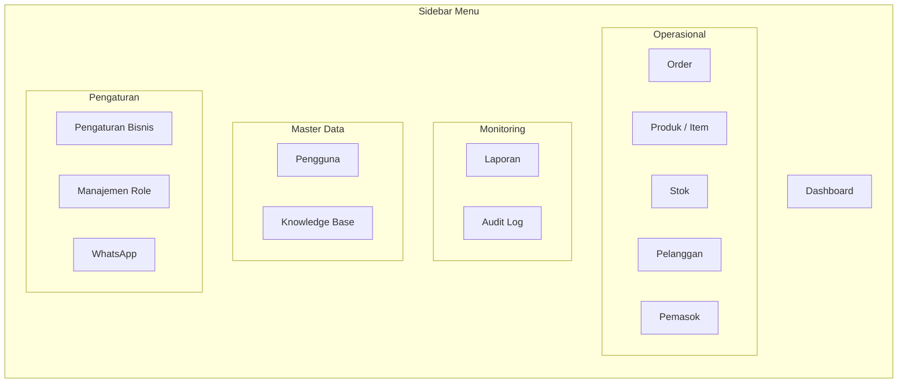
```mermaid
flowchart LR
  subgraph "Sidebar Menu"
    D[Dashboard]
    subgraph "Operasional"
      O[Order]
      P[Produk / Item]
      S[Stok]
      CU[Pelanggan]
      SU[Pemasok]
    end
    subgraph "Monitoring"
      R[Laporan]
      AL[Audit Log]
    end
    subgraph "Master Data"
      U[Pengguna]
      K[Knowledge Base]
    end
    subgraph "Pengaturan"
      TC[Pengaturan Bisnis]
      RL[Manajemen Role]
      WA[WhatsApp]
    end
  end
```

> Menu yang tampil di sidebar **ditentukan oleh permission role aktif**. Menu tanpa permission tidak ditampilkan, bukan dinonaktifkan (selaras dengan UI_DESIGN.md Bab 7.4).

---

## 4. Flow Utama: Login dan Onboarding

### 4.1 Flow Login

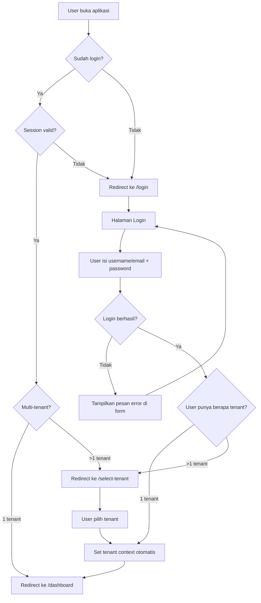
```mermaid
flowchart TD
  A[User buka aplikasi] --> B{Sudah login?}
  B -->|Ya| C{Session valid?}
  C -->|Ya| J{Multi-tenant?}
  C -->|Tidak| D[Redirect ke /login]
  B -->|Tidak| D

  D --> E[Halaman Login]
  E --> F[User isi username/email + password]
  F --> G{Login berhasil?}
  G -->|Tidak| H[Tampilkan pesan error di form]
  H --> E
  G -->|Ya| I{User punya berapa tenant?}

  I -->|1 tenant| K[Set tenant context otomatis]
  I -->|>1 tenant| L[Redirect ke /select-tenant]
  J -->|1 tenant| M[Redirect ke /dashboard]
  J -->|>1 tenant| L

  L --> N[User pilih tenant]
  N --> K
  K --> M[Redirect ke /dashboard]
```

**Aturan:**

1. Setelah login sukses dengan 1 tenant → langsung ke `/dashboard`.
2. Setelah login sukses dengan >1 tenant → ke `/select-tenant`, lalu setelah pilih → ke `/dashboard`.
3. Login gagal → pesan error tampil di form login itu sendiri, **bukan** redirect ke halaman lain.
4. Session expired saat user sedang di halaman lain → redirect ke `/login` dengan pesan "Sesi Anda telah berakhir".
5. URL sebelum session expired disimpan, sehingga setelah login ulang user kembali ke halaman terakhir.

### 4.2 Flow Post-Login: Apa yang User Lihat Pertama Kali

| Role | Halaman Pertama | Apa yang Ditampilkan |
|------|----------------|---------------------|
| Owner | Dashboard | Ringkasan metrik + order pending + stok kritis |
| Admin | Dashboard | Ringkasan metrik + order pending + stok kritis |
| Staff | Dashboard | Ringkasan metrik + order yang perlu ditindaklanjuti |

> Semua role masuk ke Dashboard sebagai landing page. Dashboard kontennya sama secara layout, tetapi owner/admin melihat shortcut ke Laporan dan Pengaturan, sedangkan staff tidak.

---

## 5. Flow Modul Order

### 5.1 Journey: Melihat dan Mengelola Order

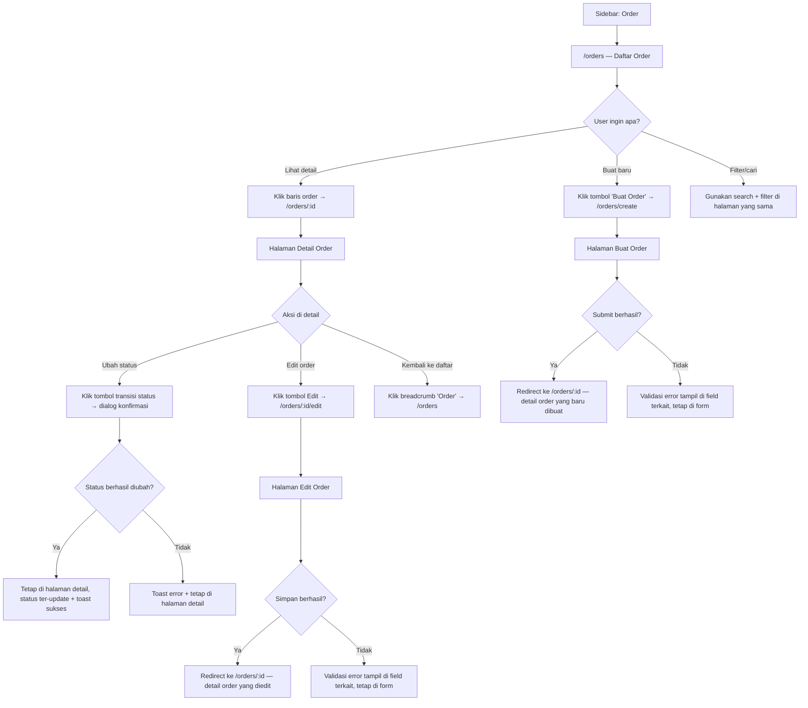
```mermaid
flowchart TD
  A["Sidebar: Order"] --> B["/orders — Daftar Order"]
  B --> C{User ingin apa?}

  C -->|Lihat detail| D["Klik baris order → /orders/:id"]
  C -->|Buat baru| E["Klik tombol 'Buat Order' → /orders/create"]
  C -->|Filter/cari| F["Gunakan search + filter di halaman yang sama"]

  D --> G[Halaman Detail Order]
  G --> H{Aksi di detail}
  H -->|Ubah status| I[Klik tombol transisi status → dialog konfirmasi]
  H -->|Edit order| J["Klik tombol Edit → /orders/:id/edit"]
  H -->|Kembali ke daftar| K["Klik breadcrumb 'Order' → /orders"]

  I --> L{Status berhasil diubah?}
  L -->|Ya| M[Tetap di halaman detail, status ter-update + toast sukses]
  L -->|Tidak| N[Toast error + tetap di halaman detail]

  E --> O[Halaman Buat Order]
  O --> P{Submit berhasil?}
  P -->|Ya| Q["Redirect ke /orders/:id — detail order yang baru dibuat"]
  P -->|Tidak| R[Validasi error tampil di field terkait, tetap di form]

  J --> S[Halaman Edit Order]
  S --> T{Simpan berhasil?}
  T -->|Ya| U["Redirect ke /orders/:id — detail order yang diedit"]
  T -->|Tidak| V[Validasi error tampil di field terkait, tetap di form]
```

**Aturan Penting:**

| Aksi | Redirect | Alasan |
|------|----------|--------|
| Buat order sukses | Detail order baru (`/orders/:id`) | User perlu melihat dan memverifikasi order yang baru dibuat |
| Edit order sukses | Detail order (`/orders/:id`) | User kembali ke konteks order yang sedang dikerjakan |
| Ubah status sukses | Tetap di detail, update in-place | Menghindari kehilangan konteks; user mungkin ingin ubah status lagi |
| Batal dari form buat | Kembali ke daftar order (`/orders`) | User membatalkan aksi, kembali ke titik awal |
| Batal dari form edit | Kembali ke detail order (`/orders/:id`) | User membatalkan edit, kembali ke detail |

**Entry Point — Tombol "Buat Order":**

| Lokasi | Ditampilkan? | Catatan |
|--------|-------------|---------|
| Halaman `/orders` (tombol utama) | ✅ Ya | Satu-satunya entry point utama |
| Dashboard (shortcut card) | ✅ Ya | Shortcut cepat, mengarah ke `/orders/create` |
| Halaman detail order | ❌ Tidak | Tidak relevan saat melihat order lain |
| Sidebar | ❌ Tidak | Sidebar hanya navigasi modul, bukan aksi |

### 5.2 Journey: Ubah Status Order (Detail)

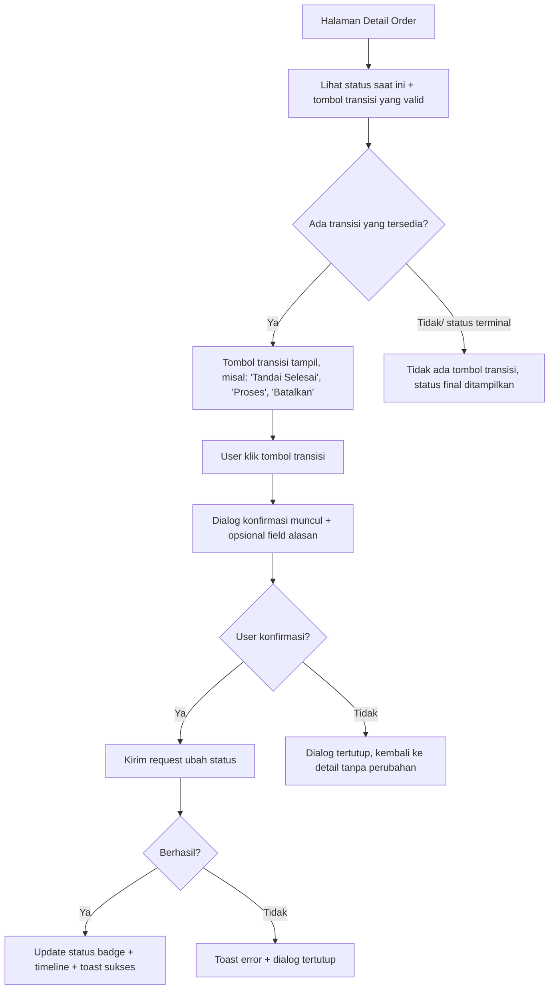
```mermaid
flowchart TD
  A[Halaman Detail Order] --> B[Lihat status saat ini + tombol transisi yang valid]
  B --> C{Ada transisi yang tersedia?}
  C -->|Ya| D[Tombol transisi tampil, misal: 'Tandai Selesai', 'Proses', 'Batalkan']
  C -->|Tidak/ status terminal| E[Tidak ada tombol transisi, status final ditampilkan]

  D --> F[User klik tombol transisi]
  F --> G[Dialog konfirmasi muncul + opsional field alasan]
  G --> H{User konfirmasi?}
  H -->|Ya| I[Kirim request ubah status]
  H -->|Tidak| J[Dialog tertutup, kembali ke detail tanpa perubahan]

  I --> K{Berhasil?}
  K -->|Ya| L[Update status badge + timeline + toast sukses]
  K -->|Tidak| M[Toast error + dialog tertutup]
```

**Aturan:**

1. Tombol transisi status **hanya muncul** jika ada transisi valid dari status sekarang (berdasarkan `order_status_transitions`).
2. Order yang sudah di status terminal **tidak menampilkan** tombol transisi apapun.
3. Setelah status berubah, bagian **timeline/histori status** di halaman detail langsung ter-update tanpa perlu reload.

---

## 6. Flow Modul Produk / Item

### 6.1 Journey: Mengelola Produk

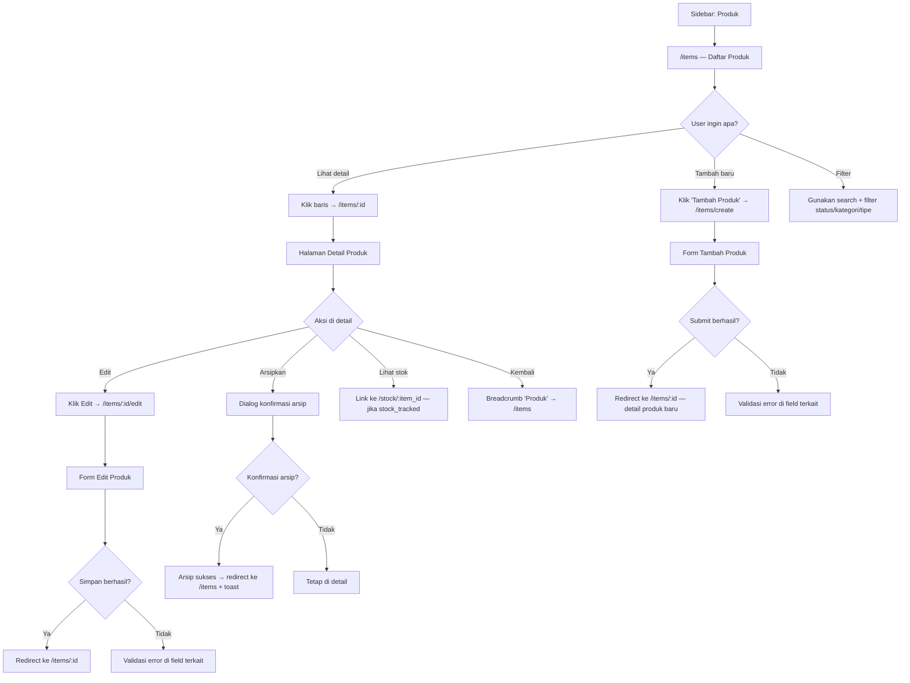
```mermaid
flowchart TD
  A["Sidebar: Produk"] --> B["/items — Daftar Produk"]
  B --> C{User ingin apa?}

  C -->|Lihat detail| D["Klik baris → /items/:id"]
  C -->|Tambah baru| E["Klik 'Tambah Produk' → /items/create"]
  C -->|Filter| F[Gunakan search + filter status/kategori/tipe]

  D --> G[Halaman Detail Produk]
  G --> H{Aksi di detail}
  H -->|Edit| I["Klik Edit → /items/:id/edit"]
  H -->|Arsipkan| J[Dialog konfirmasi arsip]
  H -->|Lihat stok| K["Link ke /stock/:item_id — jika stock_tracked"]
  H -->|Kembali| L["Breadcrumb 'Produk' → /items"]

  E --> M[Form Tambah Produk]
  M --> N{Submit berhasil?}
  N -->|Ya| O["Redirect ke /items/:id — detail produk baru"]
  N -->|Tidak| P[Validasi error di field terkait]

  I --> Q[Form Edit Produk]
  Q --> R{Simpan berhasil?}
  R -->|Ya| S["Redirect ke /items/:id"]
  R -->|Tidak| T[Validasi error di field terkait]

  J --> U{Konfirmasi arsip?}
  U -->|Ya| V[Arsip sukses → redirect ke /items + toast]
  U -->|Tidak| W[Tetap di detail]
```

**Aturan Redirect Produk:**

| Aksi | Redirect |
|------|----------|
| Tambah produk sukses | Detail produk baru (`/items/:id`) |
| Edit produk sukses | Detail produk (`/items/:id`) |
| Arsipkan produk sukses | Daftar produk (`/items`) + toast "Produk berhasil diarsipkan" |
| Batal dari form tambah | Daftar produk (`/items`) |
| Batal dari form edit | Detail produk (`/items/:id`) |

**Entry Point — Tombol "Tambah Produk":**

| Lokasi | Ditampilkan? |
|--------|-------------|
| Halaman `/items` (tombol utama) | ✅ Ya |
| Halaman detail produk | ❌ Tidak |
| Dashboard | ❌ Tidak |

### 6.2 Journey: Kategori Produk

Pengelolaan kategori diakses dari halaman daftar produk sebagai tab atau sub-navigasi, **bukan** sebagai menu sidebar terpisah.

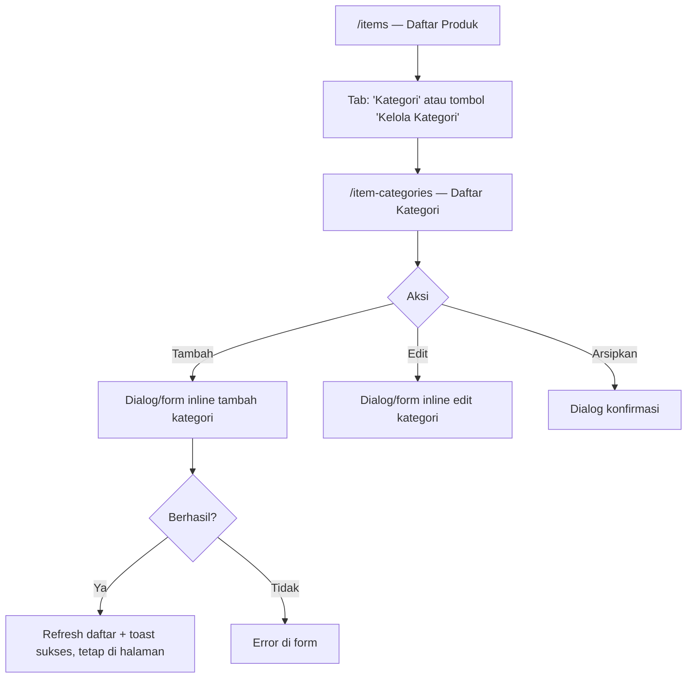
```mermaid
flowchart TD
  A["/items — Daftar Produk"] --> B["Tab: 'Kategori' atau tombol 'Kelola Kategori'"]
  B --> C["/item-categories — Daftar Kategori"]
  C --> D{Aksi}
  D -->|Tambah| E[Dialog/form inline tambah kategori]
  D -->|Edit| F[Dialog/form inline edit kategori]
  D -->|Arsipkan| G[Dialog konfirmasi]

  E --> H{Berhasil?}
  H -->|Ya| I[Refresh daftar + toast sukses, tetap di halaman]
  H -->|Tidak| J[Error di form]
```

**Aturan:**

1. Kategori menggunakan **dialog atau form inline**, bukan halaman terpisah — karena data kategori sederhana.
2. Setelah CRUD kategori, user **tetap di halaman kategori**, tidak redirect ke tempat lain.

---

## 7. Flow Modul Stok

### 7.1 Journey: Melihat dan Mengelola Stok

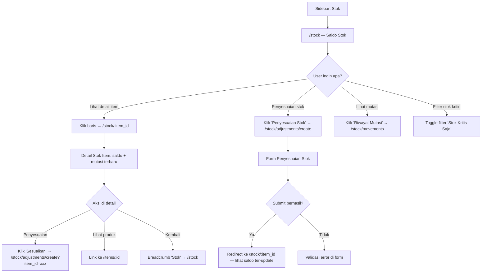
```mermaid
flowchart TD
  A["Sidebar: Stok"] --> B["/stock — Saldo Stok"]
  B --> C{User ingin apa?}

  C -->|Lihat detail item| D["Klik baris → /stock/:item_id"]
  C -->|Penyesuaian stok| E["Klik 'Penyesuaian Stok' → /stock/adjustments/create"]
  C -->|Lihat mutasi| F["Klik 'Riwayat Mutasi' → /stock/movements"]
  C -->|Filter stok kritis| G["Toggle filter 'Stok Kritis Saja'"]

  D --> H[Detail Stok Item: saldo + mutasi terbaru]
  H --> I{Aksi di detail}
  I -->|Penyesuaian| J["Klik 'Sesuaikan' → /stock/adjustments/create?item_id=xxx"]
  I -->|Lihat produk| K["Link ke /items/:id"]
  I -->|Kembali| L["Breadcrumb 'Stok' → /stock"]

  E --> M[Form Penyesuaian Stok]
  M --> N{Submit berhasil?}
  N -->|Ya| O["Redirect ke /stock/:item_id — lihat saldo ter-update"]
  N -->|Tidak| P[Validasi error di form]
```

**Aturan Redirect Stok:**

| Aksi | Redirect |
|------|----------|
| Penyesuaian stok sukses | Detail stok item (`/stock/:item_id`) |
| Penyesuaian stok dari detail item | Detail stok item yang sama (`/stock/:item_id`) |
| Batal dari form penyesuaian | Saldo stok (`/stock`) atau detail item (jika dari detail) |

**Entry Point — Tombol "Penyesuaian Stok":**

| Lokasi | Ditampilkan? |
|--------|-------------|
| Halaman `/stock` (tombol utama) | ✅ Ya |
| Halaman `/stock/:item_id` (kontekstual) | ✅ Ya (item sudah ter-prefill) |
| Dashboard | ❌ Tidak |

**Catatan MVP:** Halaman stok tidak menampilkan selector lokasi karena MVP beroperasi single-location (selaras dengan UI_DESIGN.md Bab 8.4 dan SYSTEM_DESIGN.md Bab 5.8).

---

## 8. Flow Modul Laporan

### 8.1 Journey: Melihat Laporan

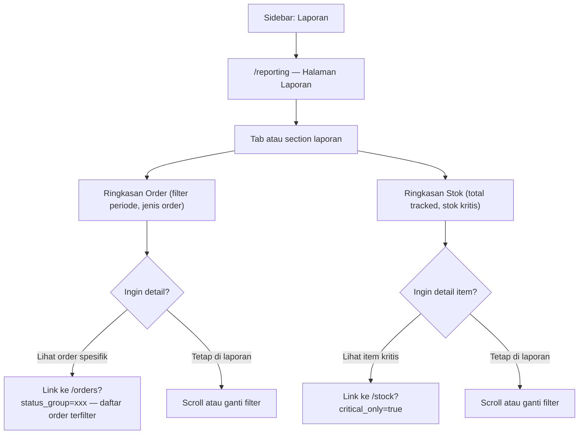
```mermaid
flowchart TD
  A["Sidebar: Laporan"] --> B["/reporting — Halaman Laporan"]
  B --> C[Tab atau section laporan]

  C --> D["Ringkasan Order (filter periode, jenis order)"]
  C --> E["Ringkasan Stok (total tracked, stok kritis)"]

  D --> F{Ingin detail?}
  F -->|Lihat order spesifik| G["Link ke /orders?status_group=xxx — daftar order terfilter"]
  F -->|Tetap di laporan| H[Scroll atau ganti filter]

  E --> I{Ingin detail item?}
  I -->|Lihat item kritis| J["Link ke /stock?critical_only=true"]
  I -->|Tetap di laporan| K[Scroll atau ganti filter]
```

**Aturan:**

1. Halaman laporan **tidak membuka halaman baru** untuk setiap metrik. Laporan ditampilkan sebagai section dalam satu halaman.
2. Link ke modul lain (order, stok) membawa filter yang relevan — misalnya klik "5 Order Pending" mengarah ke `/orders?status_group=pending`.
3. Laporan **bukan** duplikasi dashboard. Dashboard menampilkan snapshot hari ini, laporan memungkinkan eksplorasi periode.

| Aspek | Dashboard | Laporan |
|-------|-----------|---------|
| Periode | Hari ini (fixed) | Dapat difilter |
| Kedalaman | Ringkasan cepat | Tabel detail + filter |
| Tujuan | Glance sekilas | Analisis dan eksplorasi |
| Aksi | Shortcut ke modul | Link ke data detail |

---

## 9. Flow Modul Pengguna

### 9.1 Journey: Mengelola Pengguna

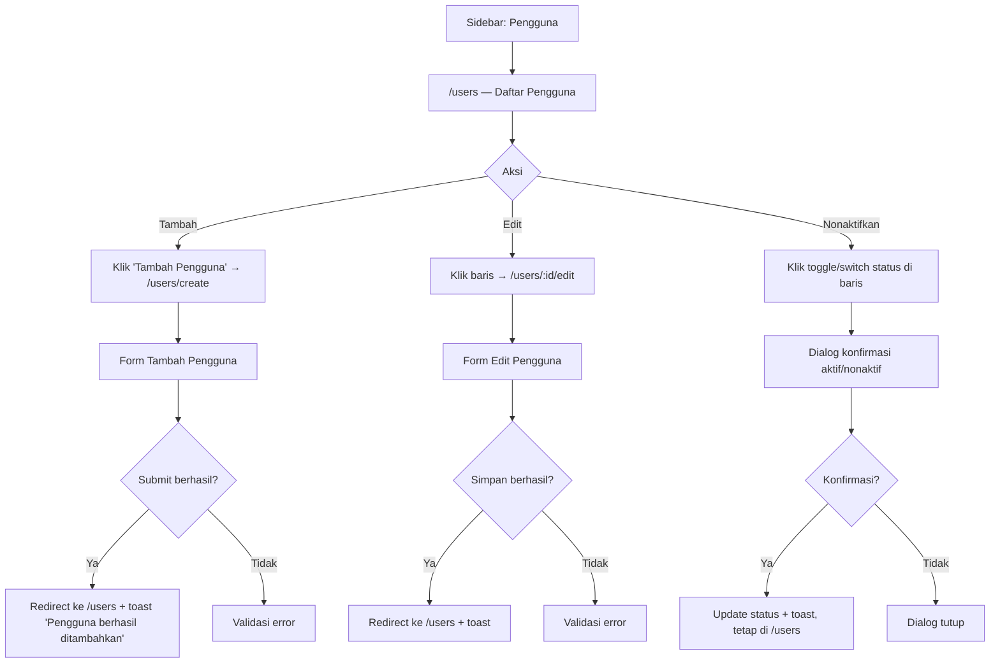
```mermaid
flowchart TD
  A["Sidebar: Pengguna"] --> B["/users — Daftar Pengguna"]
  B --> C{Aksi}

  C -->|Tambah| D["Klik 'Tambah Pengguna' → /users/create"]
  C -->|Edit| E["Klik baris → /users/:id/edit"]
  C -->|Nonaktifkan| F["Klik toggle/switch status di baris"]

  D --> G[Form Tambah Pengguna]
  G --> H{Submit berhasil?}
  H -->|Ya| I[Redirect ke /users + toast 'Pengguna berhasil ditambahkan']
  H -->|Tidak| J[Validasi error]

  E --> K[Form Edit Pengguna]
  K --> L{Simpan berhasil?}
  L -->|Ya| M[Redirect ke /users + toast]
  L -->|Tidak| N[Validasi error]

  F --> O[Dialog konfirmasi aktif/nonaktif]
  O --> P{Konfirmasi?}
  P -->|Ya| Q[Update status + toast, tetap di /users]
  P -->|Tidak| R[Dialog tutup]
```

**Aturan Redirect Pengguna:**

| Aksi | Redirect | Alasan |
|------|----------|--------|
| Tambah user sukses | Daftar pengguna (`/users`) | User admin kembali ke overview tim |
| Edit user sukses | Daftar pengguna (`/users`) | Kembali ke konteks manajemen tim |
| Nonaktifkan user | Tetap di daftar, update in-place | Aksi ringan, tidak perlu pindah halaman |

> Pengelolaan pengguna **tidak memiliki halaman detail terpisah**. Data pengguna cukup sederhana sehingga edit langsung menjadi halaman utama interaksi.

---

## 10. Flow Modul Pengaturan

### 10.1 Journey: Pengaturan Bisnis

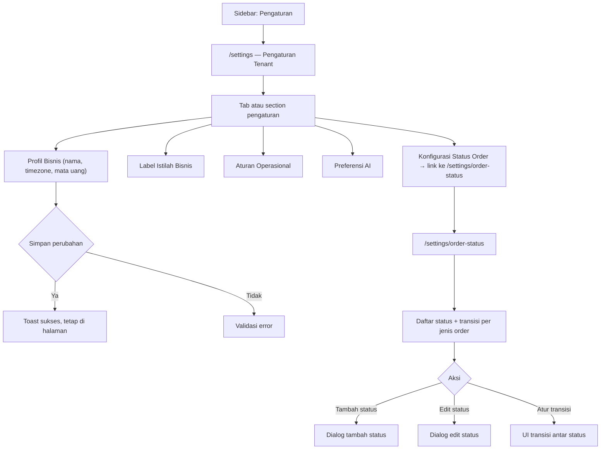
```mermaid
flowchart TD
  A["Sidebar: Pengaturan"] --> B["/settings — Pengaturan Tenant"]
  B --> C[Tab atau section pengaturan]

  C --> D["Profil Bisnis (nama, timezone, mata uang)"]
  C --> E["Label Istilah Bisnis"]
  C --> F["Aturan Operasional"]
  C --> G["Preferensi AI"]
  C --> H["Konfigurasi Status Order → link ke /settings/order-status"]

  D --> I{Simpan perubahan}
  I -->|Ya| J[Toast sukses, tetap di halaman]
  I -->|Tidak| K[Validasi error]

  H --> L["/settings/order-status"]
  L --> M["Daftar status + transisi per jenis order"]
  M --> N{Aksi}
  N -->|Tambah status| O[Dialog tambah status]
  N -->|Edit status| P[Dialog edit status]
  N -->|Atur transisi| Q[UI transisi antar status]
```

**Aturan:**

1. Pengaturan menggunakan **satu halaman dengan section/tab**, bukan banyak halaman terpisah.
2. Status order configuration adalah satu-satunya sub-halaman pengaturan yang memerlukan halaman sendiri karena kompleksitasnya (status + transisi).
3. Setiap perubahan pengaturan: **simpan in-place, toast sukses, tetap di halaman**.

---

## 11. Flow Modul Knowledge Base

### 11.1 Journey: Mengelola Knowledge

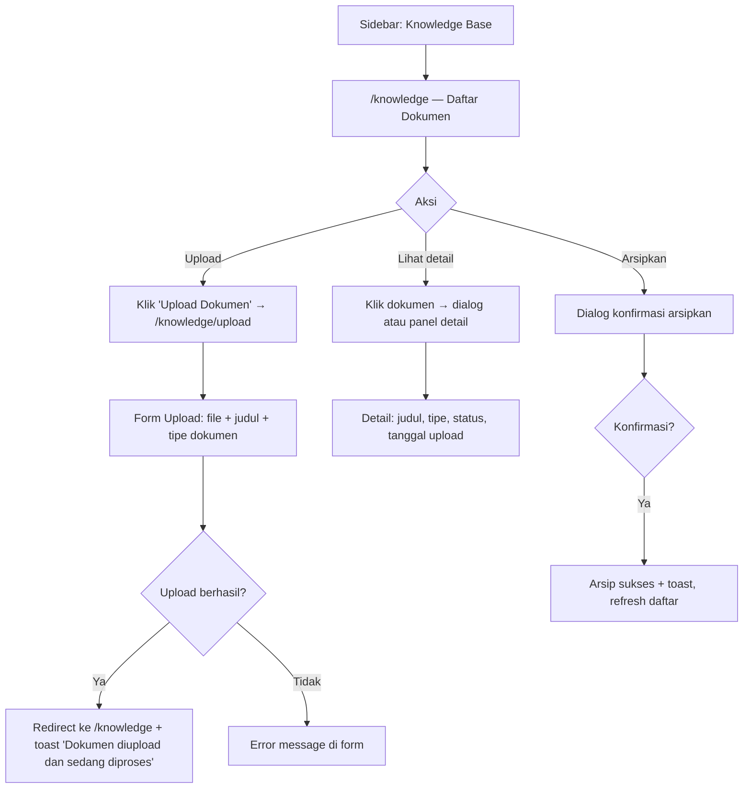
```mermaid
flowchart TD
  A["Sidebar: Knowledge Base"] --> B["/knowledge — Daftar Dokumen"]
  B --> C{Aksi}

  C -->|Upload| D["Klik 'Upload Dokumen' → /knowledge/upload"]
  C -->|Lihat detail| E["Klik dokumen → dialog atau panel detail"]
  C -->|Arsipkan| F[Dialog konfirmasi arsipkan]

  D --> G[Form Upload: file + judul + tipe dokumen]
  G --> H{Upload berhasil?}
  H -->|Ya| I[Redirect ke /knowledge + toast 'Dokumen diupload dan sedang diproses']
  H -->|Tidak| J[Error message di form]

  E --> K[Detail: judul, tipe, status, tanggal upload]
  F --> L{Konfirmasi?}
  L -->|Ya| M[Arsip sukses + toast, refresh daftar]
```

**Aturan:**

1. Upload dokumen → redirect ke daftar knowledge karena proses ingestion berjalan di background.
2. Status processing ditampilkan di daftar (badge: "Diproses", "Siap", "Gagal").
3. Detail dokumen cukup sebagai **panel samping atau dialog**, tidak perlu halaman full terpisah.

---

## 12. Flow Modul WhatsApp Admin

### 12.1 Journey: Mengelola WhatsApp

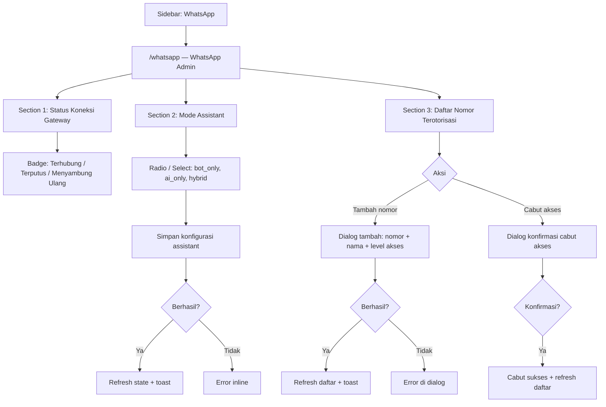
```mermaid
flowchart TD
  A["Sidebar: WhatsApp"] --> B["/whatsapp — WhatsApp Admin"]
  B --> C["Section 1: Status Koneksi Gateway"]
  B --> D["Section 2: Mode Assistant"]
  B --> E["Section 3: Daftar Nomor Terotorisasi"]

  C --> F["Badge: Terhubung / Terputus / Menyambung Ulang"]

  D --> G["Radio / Select: bot_only, ai_only, hybrid"]
  G --> H["Simpan konfigurasi assistant"]
  H --> I{Berhasil?}
  I -->|Ya| J[Refresh state + toast]
  I -->|Tidak| K[Error inline]

  E --> L{Aksi}
  L -->|Tambah nomor| M["Dialog tambah: nomor + nama + level akses"]
  L -->|Cabut akses| N["Dialog konfirmasi cabut akses"]

  M --> O{Berhasil?}
  O -->|Ya| P[Refresh daftar + toast]
  O -->|Tidak| Q[Error di dialog]

  N --> R{Konfirmasi?}
  R -->|Ya| S[Cabut sukses + refresh daftar]
```

**Aturan:**

1. WhatsApp admin adalah **satu halaman** dengan tiga section: status gateway, mode assistant, dan daftar otorisasi.
2. Pengaturan mode assistant cukup sederhana: `bot_only`, `ai_only`, atau `hybrid`.
3. Pengelolaan nomor menggunakan **dialog**, bukan halaman terpisah.
4. Status gateway hanya **ditampilkan**, bukan dikontrol dari UI (reconnect terjadi otomatis di backend).

---

## 13. Flow Switch Role

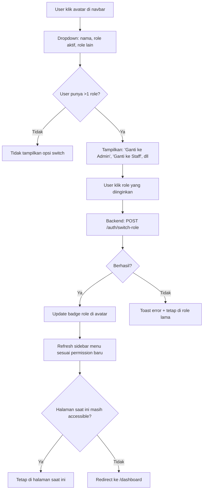
```mermaid
flowchart TD
  A[User klik avatar di navbar] --> B[Dropdown: nama, role aktif, role lain]
  B --> C{User punya >1 role?}
  C -->|Tidak| D[Tidak tampilkan opsi switch]
  C -->|Ya| E["Tampilkan: 'Ganti ke Admin', 'Ganti ke Staff', dll"]

  E --> F[User klik role yang diinginkan]
  F --> G["Backend: POST /auth/switch-role"]
  G --> H{Berhasil?}
  H -->|Ya| I[Update badge role di avatar]
  I --> J[Refresh sidebar menu sesuai permission baru]
  J --> K{Halaman saat ini masih accessible?}
  K -->|Ya| L[Tetap di halaman saat ini]
  K -->|Tidak| M[Redirect ke /dashboard]
  H -->|Tidak| N[Toast error + tetap di role lama]
```

**Aturan Penting:**

1. Switch role **tidak memerlukan logout**.
2. Saat switch, sidebar **langsung berubah** tanpa reload halaman penuh.
3. Jika halaman saat ini tidak accessible dengan role baru (misal: staff switch ke role staff dari halaman `/users`), user di-redirect ke `/dashboard`.
4. Jika halaman saat ini tetap accessible, user tetap di halaman yang sama.

---

## 14. Flow Dashboard

### 14.1 Journey di Dashboard

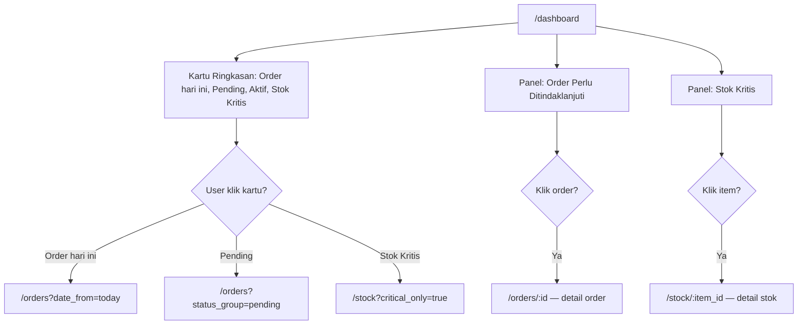
```mermaid
flowchart TD
  A["/dashboard"] --> B["Kartu Ringkasan: Order hari ini, Pending, Aktif, Stok Kritis"]
  B --> C{User klik kartu?}
  C -->|Order hari ini| D["/orders?date_from=today"]
  C -->|Pending| E["/orders?status_group=pending"]
  C -->|Stok Kritis| F["/stock?critical_only=true"]

  A --> G["Panel: Order Perlu Ditindaklanjuti"]
  G --> H{Klik order?}
  H -->|Ya| I["/orders/:id — detail order"]

  A --> J["Panel: Stok Kritis"]
  J --> K{Klik item?}
  K -->|Ya| L["/stock/:item_id — detail stok"]
```

**Aturan:**

1. Dashboard = **hub navigasi cepat**, bukan tempat melakukan CRUD.
2. Setiap kartu ringkasan yang clickable **harus mengarah ke halaman yang sudah terfilter** sesuai konteks kartu.
3. Dashboard **tidak menduplikasi** data yang sudah ada di halaman Laporan. Dashboard menampilkan snapshot hari ini, Laporan untuk eksplorasi periode.
4. Tombol "Buat Order" di dashboard **diperbolehkan** sebagai shortcut, karena ini aksi paling sering dilakukan staf (selaras dengan entry point di Bab 5.1).

---

## 15. Flow Modul Pelanggan & Pemasok

> **Catatan Arsitektur:** Pelanggan dan Pemasok dipisahkan di level UI (sidebar, URL, halaman) untuk kejelasan operasional, tetapi di backend keduanya dilayani oleh satu service `BusinessParty` dengan filter `party_type`. Pola journey keduanya **identik** — hanya konteks dan label yang berbeda.

### 15.1 Journey: Pelanggan

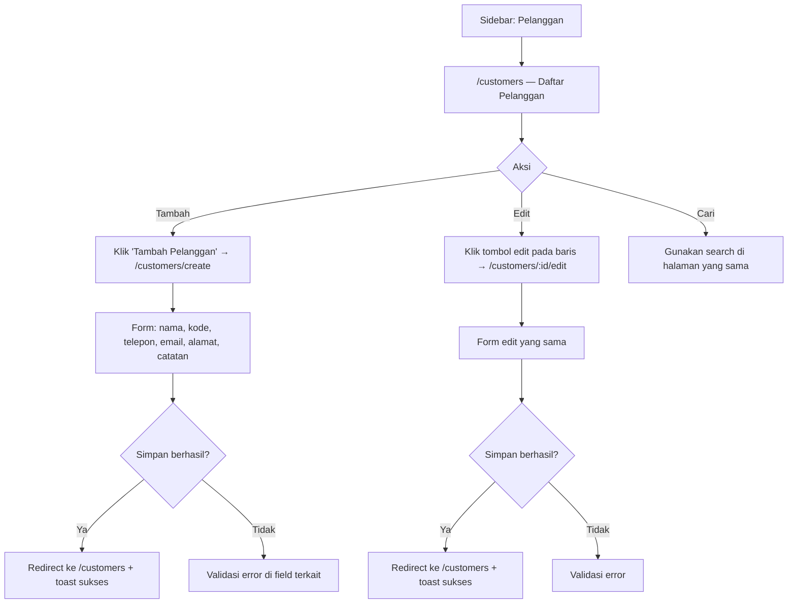
```mermaid
flowchart TD
  A["Sidebar: Pelanggan"] --> B["/customers — Daftar Pelanggan"]
  B --> C{Aksi}

  C -->|Tambah| D["Klik 'Tambah Pelanggan' → /customers/create"]
  C -->|Edit| E["Klik tombol edit pada baris → /customers/:id/edit"]
  C -->|Cari| F["Gunakan search di halaman yang sama"]

  D --> G[Form: nama, kode, telepon, email, alamat, catatan]
  G --> H{Simpan berhasil?}
  H -->|Ya| I["Redirect ke /customers + toast sukses"]
  H -->|Tidak| J[Validasi error di field terkait]

  E --> K[Form edit yang sama]
  K --> L{Simpan berhasil?}
  L -->|Ya| M["Redirect ke /customers + toast sukses"]
  L -->|Tidak| N[Validasi error]
```

### 15.2 Journey: Pemasok

Identik dengan Journey Pelanggan di atas, tetapi menggunakan URL `/suppliers`, label "Pemasok", dan memanggil endpoint `POST/PATCH /api/v1/suppliers`.

### 15.3 Aturan

| Aturan | Keterangan |
|--------|------------|
| Halaman list terpisah | `/customers` dan `/suppliers` adalah halaman yang berbeda — tidak digabung |
| Tidak ada halaman detail | Untuk MVP, pelanggan dan pemasok tidak punya halaman detail terpisah. Edit langsung dari daftar |
| Arsip dari daftar | Tombol arsip (dengan konfirmasi dialog) ada di baris tabel, bukan di halaman detail |
| Redirect setelah form | Kembali ke daftar yang relevan (create/edit pelanggan → `/customers`, pemasok → `/suppliers`) |

---

## 16. Flow Modul Manajemen Role (Dynamic Role)

> **Catatan Akses:** Halaman ini hanya dapat diakses oleh user dengan permission `role.manage`. Secara default hanya role `owner` yang memiliki permission ini.

### 16.1 Journey: Mengelola Role

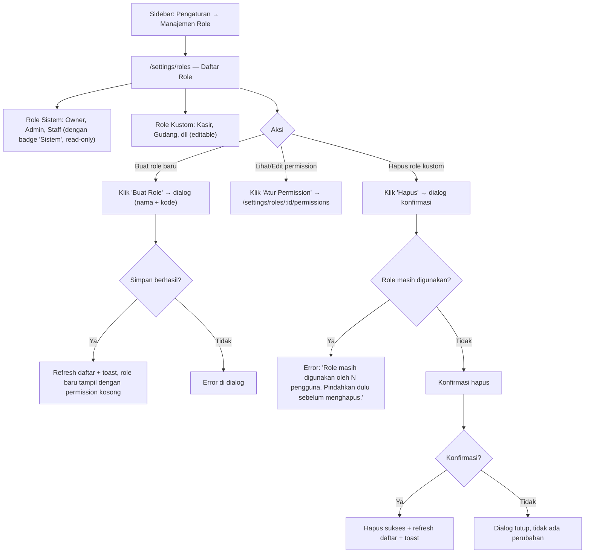
```mermaid
flowchart TD
  A["Sidebar: Pengaturan → Manajemen Role"] --> B["/settings/roles — Daftar Role"]

  B --> C["Role Sistem: Owner, Admin, Staff (dengan badge 'Sistem', read-only)"]
  B --> D["Role Kustom: Kasir, Gudang, dll (editable)"]

  B --> E{Aksi}
  E -->|Buat role baru| F["Klik 'Buat Role' → dialog (nama + kode)"]
  E -->|Lihat/Edit permission| G["Klik 'Atur Permission' → /settings/roles/:id/permissions"]
  E -->|Hapus role kustom| H["Klik 'Hapus' → dialog konfirmasi"]

  F --> I{Simpan berhasil?}
  I -->|Ya| J["Refresh daftar + toast, role baru tampil dengan permission kosong"]
  I -->|Tidak| K["Error di dialog"]

  H --> L{Role masih digunakan?}
  L -->|Ya| M["Error: 'Role masih digunakan oleh N pengguna. Pindahkan dulu sebelum menghapus.'"]
  L -->|Tidak| N[Konfirmasi hapus]
  N --> O{Konfirmasi?}
  O -->|Ya| P["Hapus sukses + refresh daftar + toast"]
  O -->|Tidak| Q["Dialog tutup, tidak ada perubahan"]
```

### 16.2 Journey: Edit Matrix Permission

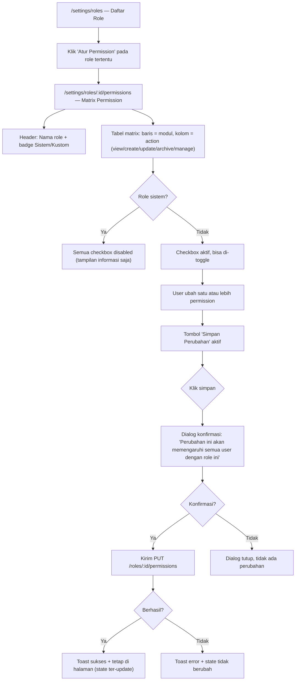
```mermaid
flowchart TD
  A["/settings/roles — Daftar Role"] --> B["Klik 'Atur Permission' pada role tertentu"]
  B --> C["/settings/roles/:id/permissions — Matrix Permission"]

  C --> D["Header: Nama role + badge Sistem/Kustom"]
  C --> E["Tabel matrix: baris = modul, kolom = action (view/create/update/archive/manage)"]

  E --> F{Role sistem?}
  F -->|Ya| G["Semua checkbox disabled (tampilan informasi saja)"]
  F -->|Tidak| H["Checkbox aktif, bisa di-toggle"]

  H --> I[User ubah satu atau lebih permission]
  I --> J["Tombol 'Simpan Perubahan' aktif"]
  J --> K{Klik simpan}
  K --> L["Dialog konfirmasi: 'Perubahan ini akan memengaruhi semua user dengan role ini'"]
  L --> M{Konfirmasi?}
  M -->|Ya| N["Kirim PUT /roles/:id/permissions"]
  N --> O{Berhasil?}
  O -->|Ya| P["Toast sukses + tetap di halaman (state ter-update)"]
  O -->|Tidak| Q["Toast error + state tidak berubah"]
  M -->|Tidak| R["Dialog tutup, tidak ada perubahan"]
```

### 16.3 Aturan

| Aturan | Keterangan |
|--------|------------|
| Role sistem read-only | Matrix permission role sistem hanya bisa dilihat, tidak bisa diubah |
| Konfirmasi wajib | Perubahan permission selalu minta konfirmasi karena berdampak ke banyak user |
| Efek perubahan | Perubahan berlaku pada sesi berikutnya user yang menggunakan role tersebut |
| Tidak ada auto-save | User harus klik "Simpan" eksplisit — tidak ada auto-save saat toggle checkbox |
| Entry point tunggal | Halaman role management hanya bisa diakses dari Pengaturan → Manajemen Role |

---

## 17. State Halaman Standard

Setiap halaman harus menangani empat state berikut secara konsisten:

### 15.1 Loading State

| Komponen | Behavior |
|----------|----------|
| Tabel data | Skeleton rows atau spinner di area tabel |
| Kartu ringkasan | Skeleton cards |
| Form | Disabled fields + spinner pada tombol submit |
| Detail | Skeleton layout |

Aturan: **Skeleton lebih diutamakan** daripada spinner full-page agar layout tidak bergeser.

### 15.2 Empty State

| Konteks | Pesan | Aksi |
|---------|-------|------|
| Daftar order kosong | "Belum ada order. Buat order pertama Anda." | Tombol "Buat Order" |
| Daftar produk kosong | "Belum ada produk. Tambahkan produk pertama." | Tombol "Tambah Produk" |
| Stok kosong | "Belum ada item yang dipantau stoknya." | Link ke daftar produk |
| Pencarian tanpa hasil | "Tidak ditemukan hasil untuk 'xxx'." | Tombol "Reset Pencarian" |
| Laporan tanpa data | "Belum ada data untuk periode ini." | Saran ganti filter periode |

Aturan: Empty state **selalu menyertakan arahan** apa yang harus dilakukan user selanjutnya.

### 15.3 Error State

| Tipe Error | Pesan | Aksi |
|------------|-------|------|
| Gagal memuat data | "Gagal memuat data. Coba lagi." | Tombol "Coba Lagi" |
| Akses ditolak (403) | "Anda tidak memiliki akses ke halaman ini." | Link "Kembali ke Dashboard" |
| Halaman tidak ditemukan (404) | "Halaman tidak ditemukan." | Link "Kembali ke Dashboard" |
| Gagal menyimpan | "Gagal menyimpan. Periksa data dan coba lagi." | Tetap di form, highlight field error |

Aturan: **Jangan tampilkan kode error teknis** ke user. Pesan harus jelas, business-friendly, dan menyertakan langkah lanjutan (selaras dengan UI_DESIGN.md Bab 10.3).

### 15.4 Success State

| Tipe | Behavior |
|------|----------|
| CRUD sukses | Toast notification (auto-dismiss 4 detik) + redirect sesuai aturan di atas |
| Status berubah sukses | Toast + update in-place tanpa redirect |
| Upload sukses | Toast + redirect ke daftar |

Aturan: Toast notification **cukup satu**, tidak perlu banner dan toast sekaligus.

---

## 18. Aturan Breadcrumb dan Navigasi Kembali

### 16.1 Pola Breadcrumb

Breadcrumb mengikuti hierarki navigasi, bukan riwayat browser:

| Halaman | Breadcrumb |
|---------|------------|
| Dashboard | Dashboard |
| Daftar Order | Dashboard > Order |
| Detail Order | Dashboard > Order > ORD-001 |
| Buat Order | Dashboard > Order > Buat Order |
| Edit Order | Dashboard > Order > ORD-001 > Edit |
| Saldo Stok | Dashboard > Stok |
| Detail Stok Item | Dashboard > Stok > SKU-001 |
| Penyesuaian Stok | Dashboard > Stok > Penyesuaian |
| Pengaturan | Dashboard > Pengaturan |
| Status Order Config | Dashboard > Pengaturan > Status Order |

### 16.2 Aturan Tombol Kembali

1. Browser back button **harus berfungsi sesuai ekspektasi** — setiap halaman di-push ke browser history.
2. Breadcrumb menjadi navigasi kembali yang jelas dan konsisten.
3. Form buat/edit memiliki tombol **"Batal"** yang mengarah ke halaman parent (sesuai aturan redirect di tiap modul).
4. **Jangan tampilkan tombol "Kembali" custom** jika sudah ada breadcrumb. Redundancy.

---

## 19. Aturan Anti-Redundancy Journey

### 17.1 Yang Harus Dihindari

| # | Jenis Redundancy | Contoh | Solusi |
|---|-----------------|--------|--------|
| 1 | Aksi sama dari banyak tempat | "Buat Order" di sidebar, dashboard, daftar order, dan navbar | Hanya di daftar order (utama) + dashboard (shortcut) |
| 2 | Halaman yang fungsinya tumpang tindih | Dashboard dan Laporan menampilkan data yang persis sama | Dashboard = snapshot hari ini, Laporan = eksplorasi periode |
| 3 | Navigasi ganda ke tujuan sama | Menu "Produk" dan "Item" yang menuju halaman sama | Gunakan satu label konsisten |
| 4 | Form yang bisa diakses dari jalur berbeda dengan behavior berbeda | Form create order dari dashboard vs dari daftar order berbeda behavior | Satu form, satu behavior, apapun entry point-nya |
| 5 | Informasi yang diulang tanpa nilai tambah | Status order tampil di badge, subtitle, card, dan panel sekaligus | Status tampil di badge (utama) + timeline (histori) saja |

### 17.2 Prinsip Entry Point

Setiap aksi CRUD hanya memiliki entry point resmi:

| Aksi | Entry Point Utama | Shortcut (Boleh) | Tidak Boleh |
|------|-------------------|-------------------|-------------|
| Buat Order | `/orders` → tombol "Buat Order" | Dashboard card | Sidebar, navbar, halaman lain |
| Tambah Produk | `/items` → tombol "Tambah Produk" | — | Dashboard, sidebar |
| Penyesuaian Stok | `/stock` → tombol "Penyesuaian" | `/stock/:item_id` → tombol "Sesuaikan" | Dashboard, sidebar |
| Tambah User | `/users` → tombol "Tambah Pengguna" | — | Dashboard, sidebar |
| Upload Knowledge | `/knowledge` → tombol "Upload" | — | Dashboard, sidebar |

---

## 18. Peta Transisi Antar Modul

Beberapa halaman memiliki link kontekstual ke modul lain:

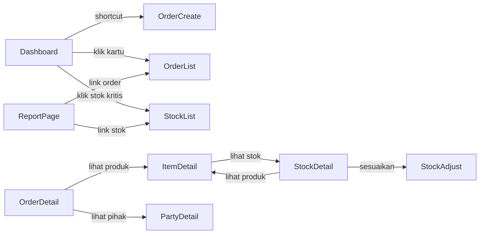
```mermaid
flowchart LR
  Dashboard -->|"shortcut"| OrderCreate
  Dashboard -->|"klik kartu"| OrderList
  Dashboard -->|"klik stok kritis"| StockList

  OrderDetail -->|"lihat produk"| ItemDetail
  OrderDetail -->|"lihat pihak"| PartyDetail

  ItemDetail -->|"lihat stok"| StockDetail
  StockDetail -->|"lihat produk"| ItemDetail
  StockDetail -->|"sesuaikan"| StockAdjust

  ReportPage -->|"link order"| OrderList
  ReportPage -->|"link stok"| StockList
```

**Aturan link antar modul:**

1. Link antar modul **boleh ada jika kontekstual** — misalnya detail order menampilkan nama produk yang bisa diklik ke detail produk.
2. Link antar modul **harus membawa filter yang relevan** — misalnya klik "5 Pending" di dashboard membuka `/orders?status_group=pending`.
3. Link antar modul **tidak menggantikan navigasi sidebar** — sidebar tetap cara utama berpindah modul.

---

## 19. Ringkasan Redirect Setelah Aksi

Tabel konsolidasi untuk seluruh modul:

| Modul | Aksi | Redirect |
|-------|------|----------|
| Order | Buat sukses | `/orders/:id` (detail baru) |
| Order | Edit sukses | `/orders/:id` (detail) |
| Order | Ubah status | Tetap di detail, update in-place |
| Order | Batal buat | `/orders` (daftar) |
| Order | Batal edit | `/orders/:id` (detail) |
| Produk | Tambah sukses | `/items/:id` (detail baru) |
| Produk | Edit sukses | `/items/:id` (detail) |
| Produk | Arsipkan sukses | `/items` (daftar) + toast |
| Produk | Batal tambah | `/items` (daftar) |
| Produk | Batal edit | `/items/:id` (detail) |
| Kategori | CRUD | Tetap di halaman kategori |
| Stok | Penyesuaian sukses | `/stock/:item_id` (detail item) |
| Stok | Batal penyesuaian | `/stock` atau `/stock/:item_id` |
| User | Tambah sukses | `/users` (daftar) |
| User | Edit sukses | `/users` (daftar) |
| User | Nonaktifkan | Tetap di `/users`, update in-place |
| Knowledge | Upload sukses | `/knowledge` (daftar) |
| Knowledge | Arsipkan | Tetap di `/knowledge`, refresh |
| Pengaturan | Simpan | Tetap di halaman, toast sukses |
| Status Config | CRUD | Tetap di halaman, refresh |
| WhatsApp | CRUD otorisasi | Tetap di halaman, refresh |
| Login | Login sukses (1 tenant) | `/dashboard` |
| Login | Login sukses (>1 tenant) | `/select-tenant` |
| Switch Role | Halaman accessible | Tetap di halaman saat ini |
| Switch Role | Halaman not accessible | `/dashboard` |

---

## 20. Acceptance Criteria

Dokumen ini dianggap terpenuhi bila:

1. Setiap halaman memiliki breadcrumb yang sesuai hierarki navigasi.
2. Setelah setiap aksi CRUD, user di-redirect ke halaman sesuai tabel di Bab 19.
3. Tidak ada aksi yang bisa dimulai dari lebih dari dua titik (entry point utama + maksimal satu shortcut).
4. Tidak ada halaman dead-end (selalu ada breadcrumb atau navigasi kembali).
5. Empty state selalu menyertakan arahan tindakan berikutnya.
6. Error state tidak menampilkan kode teknis.
7. Switch role mengubah sidebar tanpa reload halaman.
8. Dashboard tidak menduplikasi fungsi Laporan.
9. Semua link antar modul membawa filter kontekstual.
10. Pola journey (list → detail → form → kembali) konsisten di semua modul.
